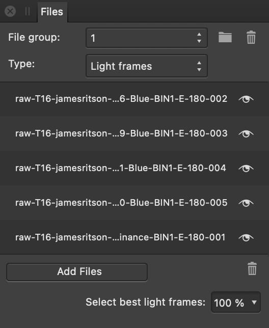

# Files panel (Astrophotography Stack Persona only)

When creating astrophotography, use the **Files** panel to provide light frames and calibration frames.

## About the Files panel

The panel displays the following:

- **File group**—select an existing file group to manage its contents.
- Add a file group—click to add a file group for frames taken at a different time.
- Delete a file group—click to instantly delete the selected file group. This cannot be undone.
- Filter—use in conjunction with file groups to specify the filter used to shoot a group's files. Select from H-alpha (Hydrogen-alpha), OIII (Oxygen-III), SII (Sulfur-II), Luminance, Red, Green, and Blue filters. By default, no filter is applied.
- **Type**—specifies the type of frames shown in and added to the list.
- **Add Files**—click to add files of the currently selected type.
- Remove selected files from the list—simultaneously remove one or more files.
- **Select best light frames**—enter a percentage of light frames to retain. Quality is determined by the presence of artefacts such as star trails and periodic errors. Analysis takes place when you press the  .

### Specifying a filter

The Filter setting is important when creating narrowband astrophotographs. When used in conjunction with file groups, it allows for simultaneous stacking of images captured using different filters.

The stacking process aligns the final stacked images during registration, using the first file group's data as a base, for the highest quality results.

With a filter selected, its name is appended to any stacked image that is created, e.g. *Stacked Image 1 (H-alpha)*.

#### SEE ALSO:

- [About astrophotography stacking](01-about-astrophotography-stacking.md)
- [Creating an astrophotography stack](02-creating-an-astrophotography-stack.md)
- [Stacking Options panel](05-stacking-options-panel.md)
- [RAW Options panel](04-raw-options-panel.md)
- [Compositing narrowband images](06-compositing-narrowband-images.md)
- [Customizing the workspace](../31-workspace/04-customize/02-workspace.md)
