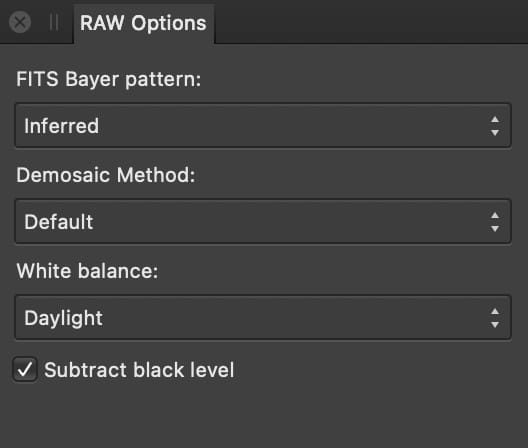

# RAW Options panel (Astrophotography Stack Persona only)

The **RAW Options** panel provides control over how image data is interpreted. Use the default settings unless your camera hardware and settings require otherwise.

## About the RAW Options panel

The panel displays the following:

- **FITS Bayer pattern**—inferred from image metadata by default, but can be manually set to a specific pattern if the results look incorrect.
- **Demosaic Method**—can be either:
  - **Default**—the same method used by the **Develop Persona**.
  - **Bilinear**—a general-purpose method that may give softer results but may also be quicker.
- **White balance**—can be:
  - **Daylight**—the default setting, which is 6500K.
  - **Camera**—derived by identifying the camera in an image's metadata.
  - **Master Flat**—inferred from the flat frames.
- **Subtract black level**—ensures pure black pixels are removed. This is enabled by default.

#### SEE ALSO:

- [About astrophotography stacking](01-about-astrophotography-stacking.md)
- [Creating an astrophotography stack](02-creating-an-astrophotography-stack.md)
- [Files panel](03-files-panel.md)
- [Stacking Options panel](05-stacking-options-panel.md)
- [Compositing narrowband images](06-compositing-narrowband-images.md)
- [Customizing the workspace](../31-workspace/04-customize/02-workspace.md)
