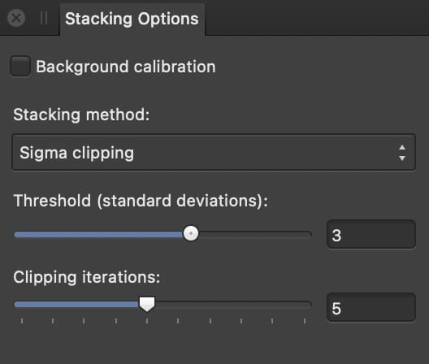

# Stacking Options panel (Astrophotography Stack Persona only)

When creating astrophotography, use the **Stacking Options** panel to control the stacking method that's used to process light and calibration frames.

## About the Stacking Options panel

The panel displays the following:

- **Background calibration**—normalizes the background level of the light frames based on a reference frame. Recommended when using sigma clipping to avoid mistakenly clipping pixels.
- **Stacking method**—the operator used to average the contents of the light frames and, separately, calibration frames, which can be:
  - **Mean**—averages pixel content across the stack of images.
  - **Median**—removes pixel content that is not consistent in each image.
  - **Sigma clipping**—clips pixels outside of a given range.
- **Threshold (standard deviations)**—if the result of sigma clipping still contains hot pixels or other erroneous data, try lowering this to about 2. However, a lower value may result in banding/posterization around high-contrast star detail.
- **Clipping iterations**—the number of passes performed during stacking. More passes may result in greater accuracy.

### About sigma clipping

Sigma clipping is the default stacking method and generally a good choice if you have a lot of data. With very limited data—less than one hour's worth of exposures—the mean and median methods are suitable.

Sigma clipping is well suited to monochrome imagery from dedicated astronomy cameras with a CCD or CMOS sensor. Although temperature-regulated, these cameras may exhibit hot pixels, sensor defects and other erroneous pixel data that would show up in the end result.

#### SEE ALSO:

- [About astrophotography stacking](01-about-astrophotography-stacking.md)
- [Creating an astrophotography stack](02-creating-an-astrophotography-stack.md)
- [Files panel](03-files-panel.md)
- [RAW Options panel](04-raw-options-panel.md)
- [Compositing narrowband images](06-compositing-narrowband-images.md)
- [Customizing the workspace](../31-workspace/04-customize/02-workspace.md)
