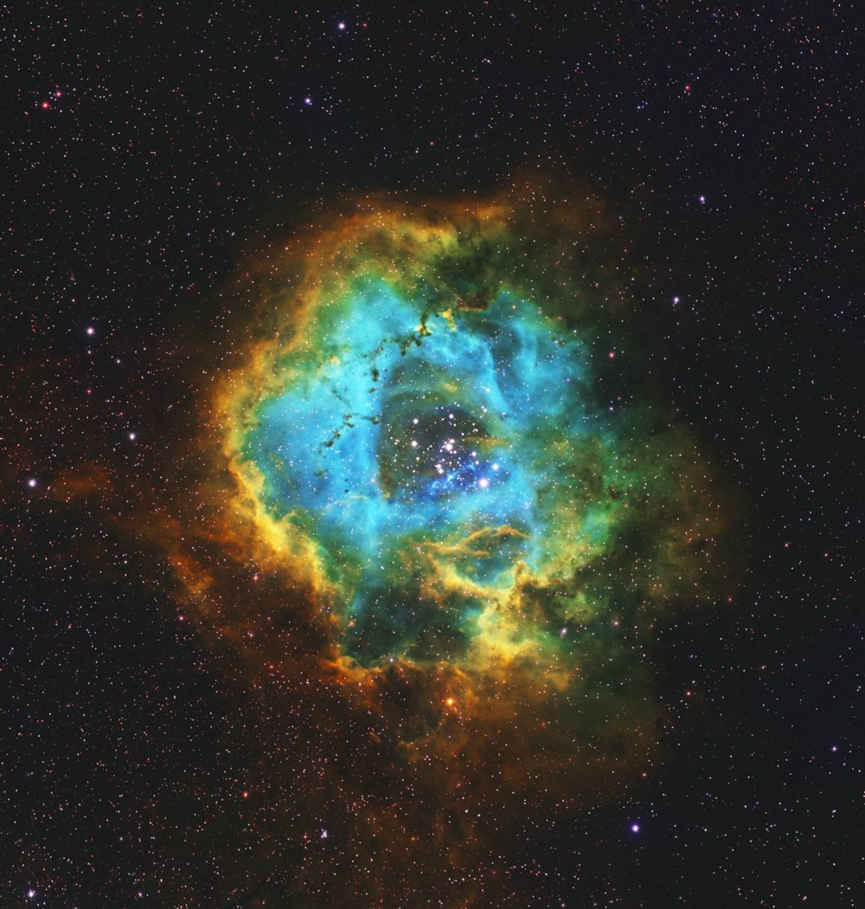
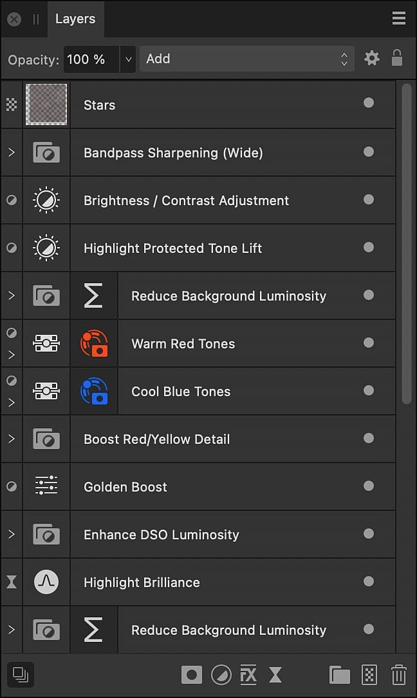

# Compositing narrowband images

Narrowband astrophotography uses astronomical filters to capture images of light from specific wavelength bands. It is often used to produce images of nebulae. A dedicated astronomy camera tends to be used.

The resulting frames are monochromatic but can be processed by the Astrophotography Stack Persona just like full-color frames.

Several mono images, each taken with a different filter, can be manually composited into a full-color image.

The most commonly used filters detect Hydrogen-alpha (Ha), Oxygen-III (O-III) and Sulfur-II (SII).

*An example of composited, full-color narrowband astrophotography.*

Before compositing, use the [Astrophotography Stack Persona](02-creating-an-astrophotography-stack.md) to create three separate images, each from a different astronomical filter's frames.

To ensure you start with a document of the correct properties, including resolution and color format, use one of your already-stacked monochromatic documents as the base on which to perform the following procedure.

1. Copy and paste a flattened version of each of the other two mono images onto a separate pixel layer in the new document.
2. For each pixel layer in turn:
  1. Select **Layer>New Adjustment Layer>Recolor**.
  2. Clip the adjustment layer to the pixel layer. (See [Layer Clipping](../07-layer-operations/07-layer-clipping.md).)
  3. Set the adjustment layer's hue uniquely to red (0°), green (120°) or blue (240°).
3. Set each pixel layer's blend mode to **Add**.
4. Perform additional post-processing work as necessary

There is no universally accepted color assignment for each chemical element, so experiment. For example, the Hubble palette assigns red to S-II, green to Ha, and blue to O-III.

Use your artistic judgment in post-processing. For example, you might:

- Perform tone-stretching by applying Brightness/Contrast, Curves and Levels adjustment layers.
- Remove distractions with noise reduction filters and retouching tools.
- Use a Fill layer with the Subtract blend mode applied to remove a color cast.

*After compositing, use additional features to refine the result.*

#### SEE ALSO:

- [About astrophotography stacking](01-about-astrophotography-stacking.md)
- [Creating an astrophotography stack](02-creating-an-astrophotography-stack.md)
- [Files panel](03-files-panel.md)
- [Stacking Options panel](05-stacking-options-panel.md)
- [RAW Options panel](04-raw-options-panel.md)
