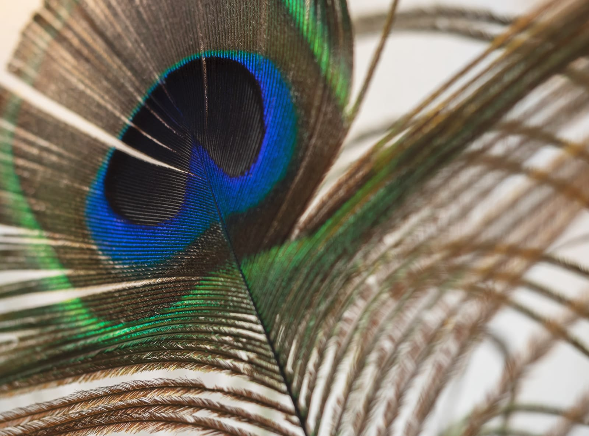
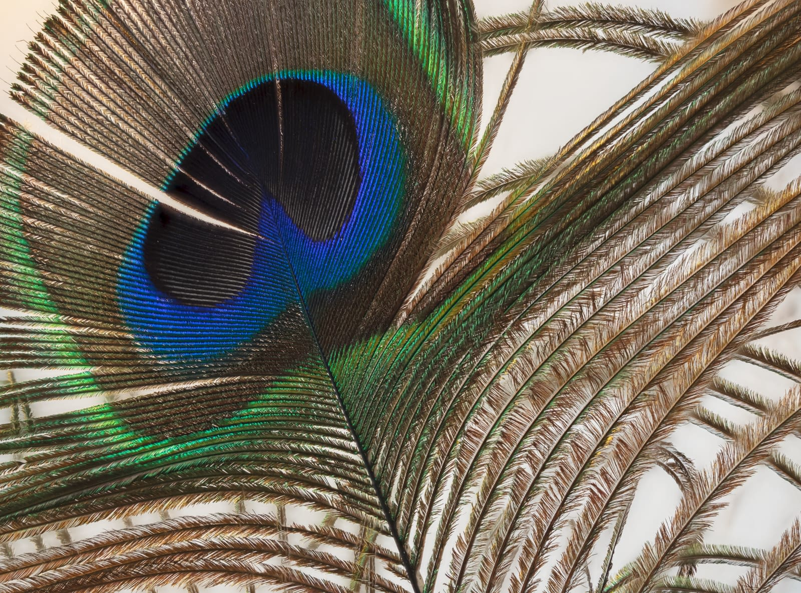
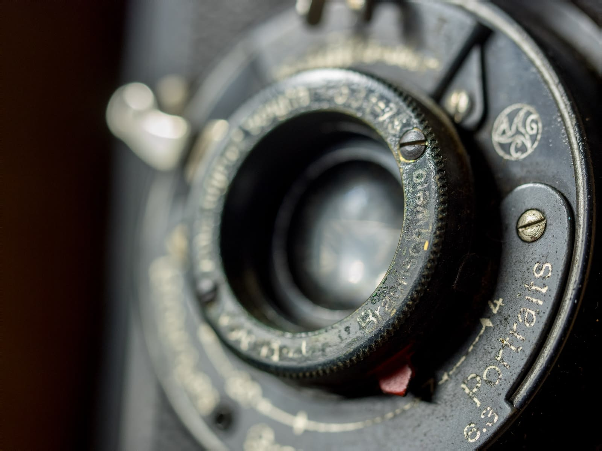
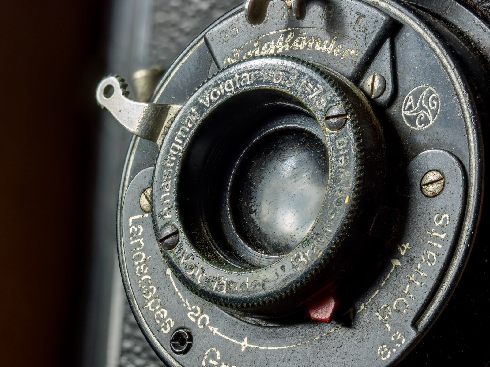

# Focus merging images

Multiple images of the same subject that have different focus distances can be merged together to create an image that has a greater depth of field. Focus merging will take the most detailed areas from each image (e.g., the areas in focus) and blend them together for the final output. The benefits of focus merging are:

- Increased depth of field for macro photography while being able to use larger apertures. This avoids having to use smaller apertures (e.g., f/16) where diffraction may become an issue and produce a soft image.
- Ensuring front-to-back sharpness with landscape photography. While hyperfocal distances typically result in a large area of the scene being in focus, focus merging can be used for more difficult scenarios, such as elements close to the lens that may not be covered by the hyperfocal distance.

***Before**: One image with shallow depth of field. **After**: 50 images focus merged to produce image with greater depth of field.*

## Shooting tips

- For best alignment, the images will want to be acquired with the camera on a tripod or some form of stabilization.
- Keep your exposure settings (shutter speed, aperture, ISO, white balance) identical between shots to produce a consistent result.
- Some cameras have a focus bracketing feature, which takes a burst of shots, changing the focus distance for each shot.
- Your focus differential (how much the focus changes between each shot) should depend on the type of photography. Macro photography will typically need a narrower differential, and more shots, to ensure front-to-back sharpness. Landscape or wide angle photography can have a wider differential and fewer shots (e.g., shots focused at foreground, hyperfocal and infinity distances).

**To focus merge several images:**

1. From the **File** menu, select **New Focus Merge**.
2. From the dialog, click **Add** to locate and select your images.
3. Click **OK** to begin merging the images.
4. The focus merging is previewed in its three stages: initial alignment, image blending, and final merging.
5. Once focus merging is complete, the final result can be seen as a new document, ready to edit.

***Before**: One image with shallow depth of field. **After**: 20 images focus merged to produce image with greater depth of field.*

#### SEE ALSO:

- [Image stacks](../17-stacking/01-image-stacks.md)
