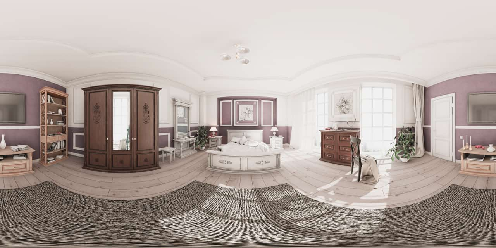
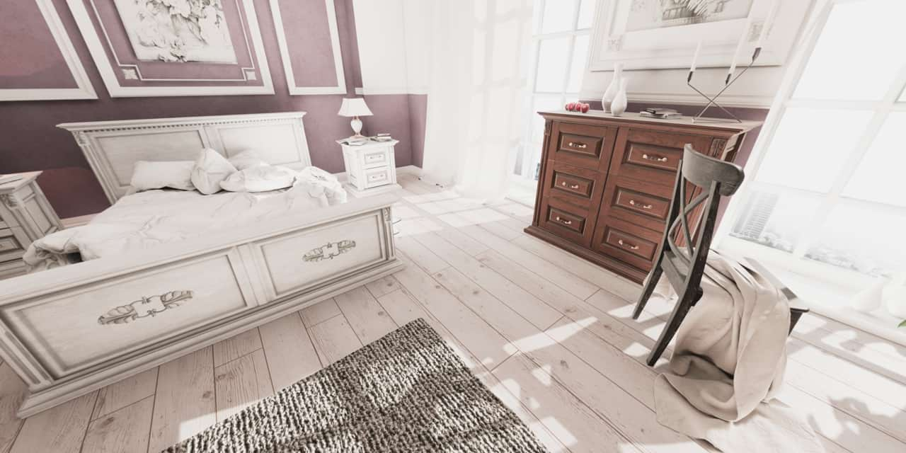
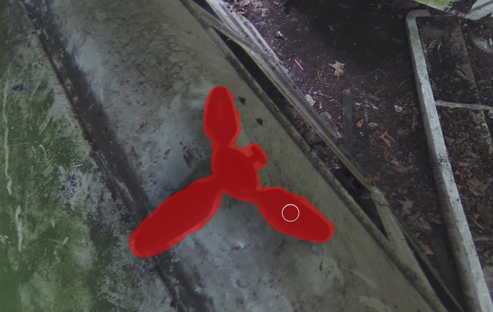
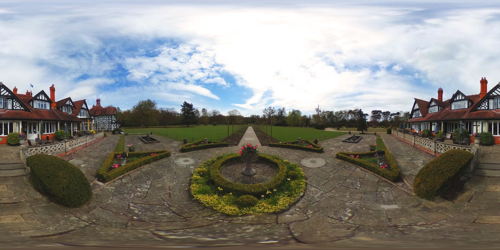
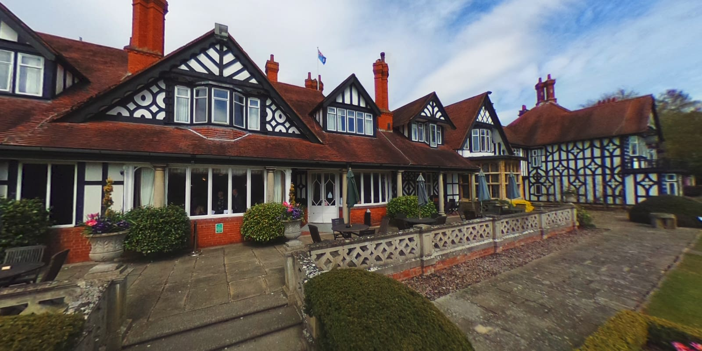

# Equirectangular projection

***Before**: Unmapped equirectangular image (360x180). **After**: Projected image.*

Equirectangular images, typically 360x180 panoramas, can be mapped to a live projection in Affinity Photo 2 and edited while they are being projected. This allows for instant feedback of detailed retouching, brush work and masking—all operations that would be difficult on an unmapped equirectangular image.

> **Note:** 360x180 imagery is often obtained either from dedicated 360 cameras, or by stitching a series of shots together using dedicated 360 stitching software.

**To edit an equirectangular image in live projection:**

1. With an equirectangular image layer selected, from the **Layer** menu, choose **Live Projection>Equirectangular Projection**.
2. The image layer will then enter live projection and the **Edit Live Projection Tool** will be automatically selected.
3. Use the **Edit Live Projection Tool** to navigate around the image until you settle on an area you wish to edit.
4. Using the appropriate tools, make your edits.

**To pan around an image in live projection:**

1. If you choose another tool when panning in live projection, you will temporarily leave the **Edit Live Projection Tool**.
2. To pan around the image again, either:
  - Choose the **Move Tool**, then from the context toolbar, select the **Edit Live Projection Tool**.
  - From the **Layer** menu, choose **Live Projection>Edit Live Projection** (you can also use the keyboard shortcut listed for this option).

**To add additional layers in live projection view:**

1. While in live projection view, you can add content to the projected image such as text, images and brush work on new layers.
2. Add your new layer content. For example, you could add some Text at the Nadir (bottom pole) with a copyright notice.
3. Position and rotate the layer as you wish using the **Move Tool**. You can also match perspective by using the **Perspective Tool**.
4. With the new layer selected, from the **Layer** menu, choose **Merge Down**. This will merge and rasterize the layer into the main equirectangular image layer.
5. Once the content is merged, you can pan around the live projection by choosing the **Move Tool**, then selecting the **Edit Live Projection Tool** from the context toolbar.

**To straighten an image:**

1. While in live projection view, you will see **Straighten** on the context toolbar.
2. To straighten the horizon of the equirectangular image, either click-drag the **Straighten** value box or click once and enter a new value in degrees.

**To change an unmapped image's center point:**

1. While in live projection view, you will see **Center Coordinate System** on the context toolbar.
2. To change the middle origin point of the unmapped image, pan the view around and choose a new view point. Click **Center Coordinate System**, then from the **Layer** menu, choose **Live Projection>Remove Projection**. The unmapped image's center point will now have changed.

**To exit live projection and convert the image back to equirectangular mapping:**

1. Converting your image layer back to its original equirectangular mapping will allow you to export and share it—some image hosts support 360 image projection, or alternatively you can implement a Javascript/WebGL-based viewer on your own web pages if you wish.
2. To clear the live projection, select your image layer, then from the **Layer** menu, choose **Live Projection>Remove Projection**.

## Examples

*Removing the tripod at the Nadir (bottom pole) using the Inpainting Brush.*

***Before**: The original equirectangular image. **After**: Using live projection to compose a scene from a certain area of the 360 image.*
