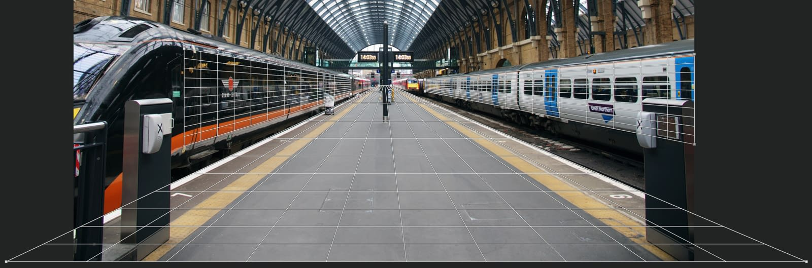
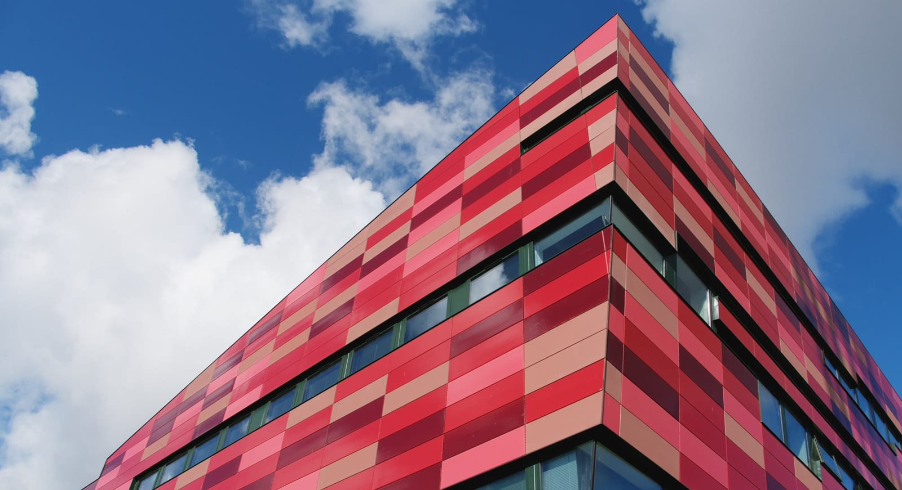
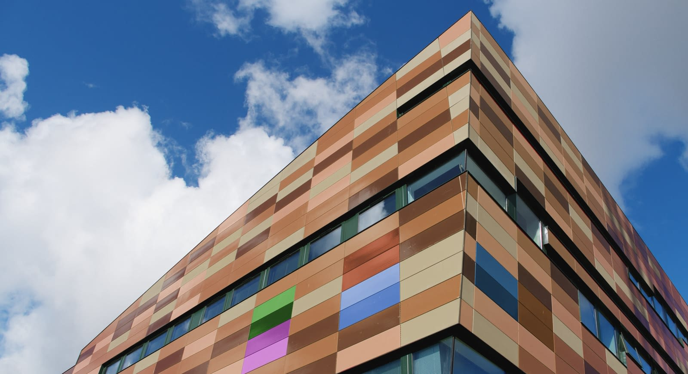

# Perspective projection

Perspective projection allows you to project (or map) perspective planes to flat 2D representations and edit them.

*Editing multiple planes in Perspective projection.*

After adding a perspective plane, you can temporarily remove perspective. This lets you apply texture, text, and brush strokes in 2D without having to manually transform the content to maintain perspective. Once edited, and the projection is removed, the added edits are transformed automatically ensuring that perspective is kept realistic.

Multiple planes can be defined—each one can be edited individually.

**To use Perspective projection:**

1. With an image open, from the **Layer** menu, choose **Live Projection>Perspective Projection**.
2. An initial perspective plane will be added covering the image. Drag the four corner nodes to align the plane to a particular area within the image (e.g., vanishing point).
3. Select any tool, adjustment or filter to automatically project the plane to a flat 2D canvas.
4. Using the appropriate tools, make your edits.
5. Once finished with the chosen perspective plane, select the **Move Tool**, then from the context toolbar, choose **Edit Live Projection**.

**To add additional perspective planes:**

1. While in the **Edit Live Projection** mode, from the context toolbar, choose **Add Plane**.
2. Transform the second plane using its corner nodes.
3. Select between multiple planes by clicking anywhere on them.

**To remove perspective planes:**

1. While in the **Edit Live Projection** mode, click on a plane to select it.
2. From the context toolbar, choose **Remove Plane**.

**To exit Live Perspective projection:**

- At any time during Perspective projection editing, from the **Layer** menu, choose **Live Projection>Remove Projection**.

## Examples

***Before**: Original image. **After**: Image with an area edited using Perspective projection.*
