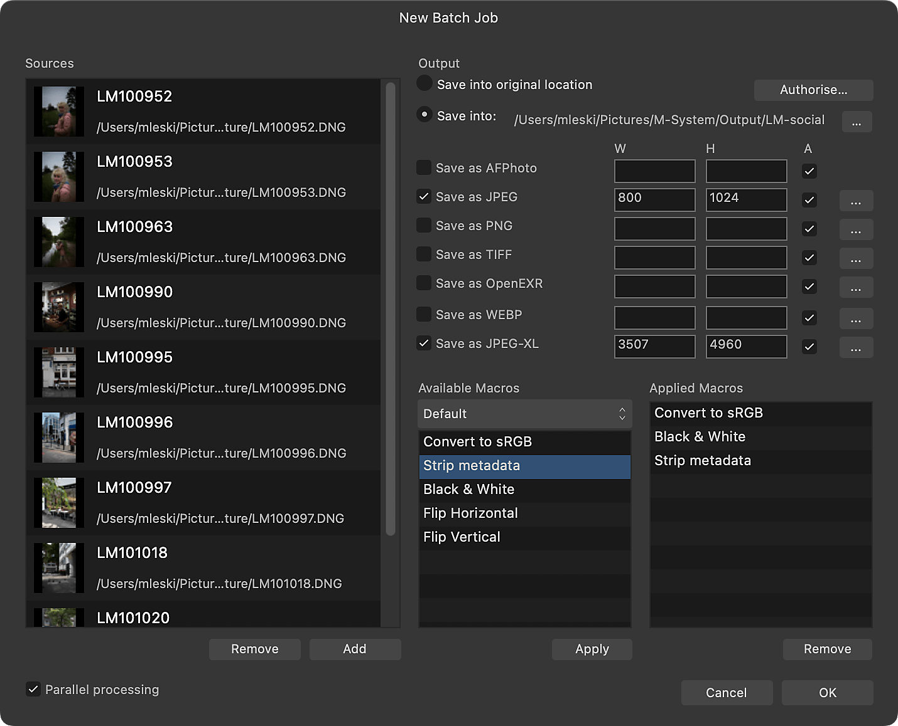

# Batch jobs

Batch jobs allow a number of image files to be processed: specific processing instructions can be automated, boosting workflow efficiency.

*The Batch Job dialog with files added to the **Sources** list.*

## About batch jobs

The **Batch Job** feature allows you to specify an unrestricted number of source files to process and export. Raw files will be automatically developed, and both the exported file format and image dimensions are configurable.

Batch jobs can work in conjunction with [Macros](01-macros.md). Any number of pre-recorded macros can be applied to the source files, meaning you can very quickly apply certain operations to several files.

**To start a batch job:**

1. On the **File** menu, choose **New Batch Job**.
2. Below the **Sources** list, choose **Add** to bring up a file import dialog.
3. Select your desired image files (including raw files) to add to the **Sources** list and click **Add**.
4. Set your Output options (see below for more information), then click **OK** to begin batch processing.

### Settings (or Preferences)

The following settings are available in the **Batch Job** panel:

- **Parallel processing**—when checked, allows images to be processed asynchronously—one for each processor core or thread. For most modern machines with dual/quad-core processors, leaving this on is recommended for more efficient processing.
- **Output**:
  - **macOS:** **Save into original location**—writes the new image files into the same directory as the originals. To use, you need to click **Authorize**, then navigate to your root Macintosh HD folder, then click **Authorize**. Once done, the **OK** button will be available to click. There's no need to navigate to the folder containing your images for batching.
  - **Windows:** **Save into original location**—writes the new image files into the same directory as the originals.
  - **Save into:**—allows you to specify a different directory to write the new image files into.
- **Save as AFPhoto**—writes an **.afphoto** version of each source image.
- **Save as JPEG**—writes a **JPEG** version of each source image.
- **Save as PNG**—writes a **PNG** version of each source image.
- **Save as TIFF**—writes a **TIFF** version of each source image.
- **macOS:** **Save as OpenEXR**—writes a **32-bit OpenEXR** version of each source image.
- **Windows:** **Save as EXR**—writes a **32-bit EXR** version of each source image.
- **Save as WEBP**—writes a **WebP** version of each source image.
- **macOS:** **Save as JPEG-XL**—writes a **JPEG-XL** version of each source image.
- **Windows:** **Save as JPEGXL**—writes a **JPEGXL** version of each source image.
- **Width**/**Height**—manually enter size dimensions for the source image.
- **Aspect**—when checked, maintains the aspect ratio of the source image.
- **Available Macros**—lists all macros in their respective categories for adding to the batch job. Click **Apply** to add the currently selected macro to the **Applied Macros** list.
- **Applied Macros**—lists macros that will be applied to each source image in the batch job.

Additional settings for individual file formats listed above are available. See [Export Settings](../27-sharing/02-export-settings.md) for more information.

#### SEE ALSO:

- [Macros](01-macros.md)
- [Export Settings](../27-sharing/02-export-settings.md)
