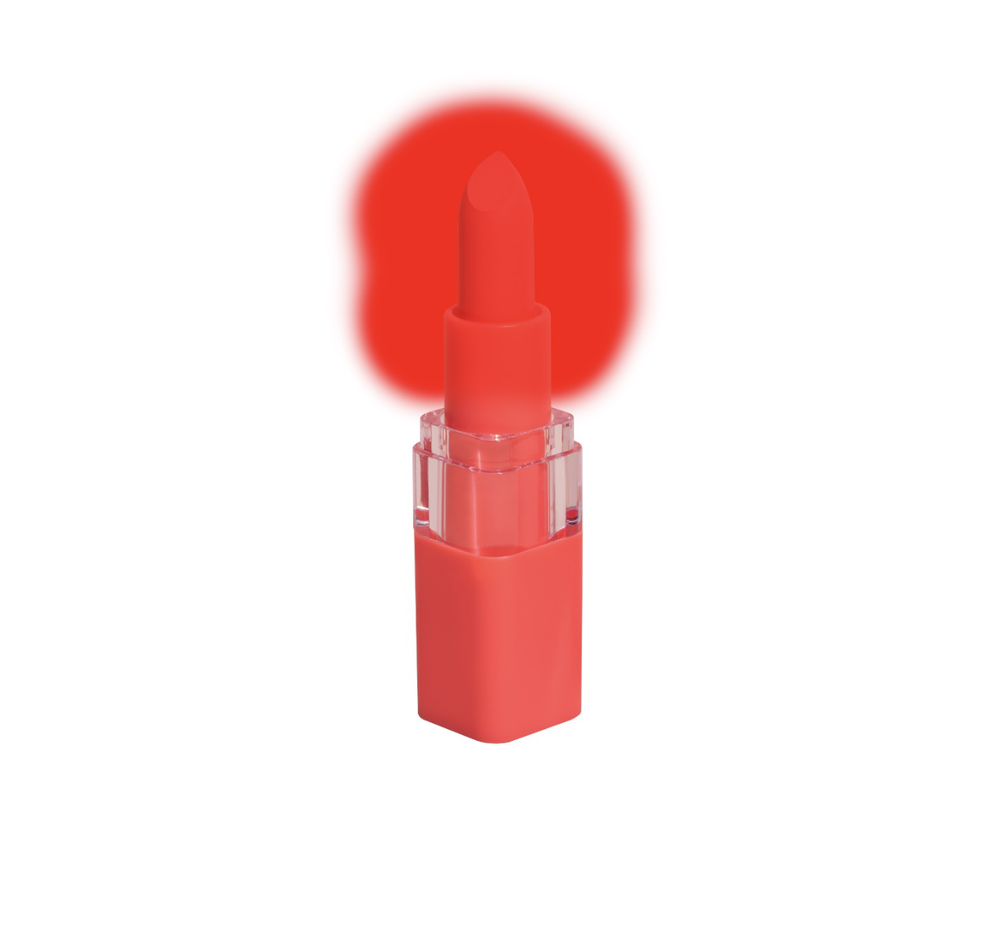
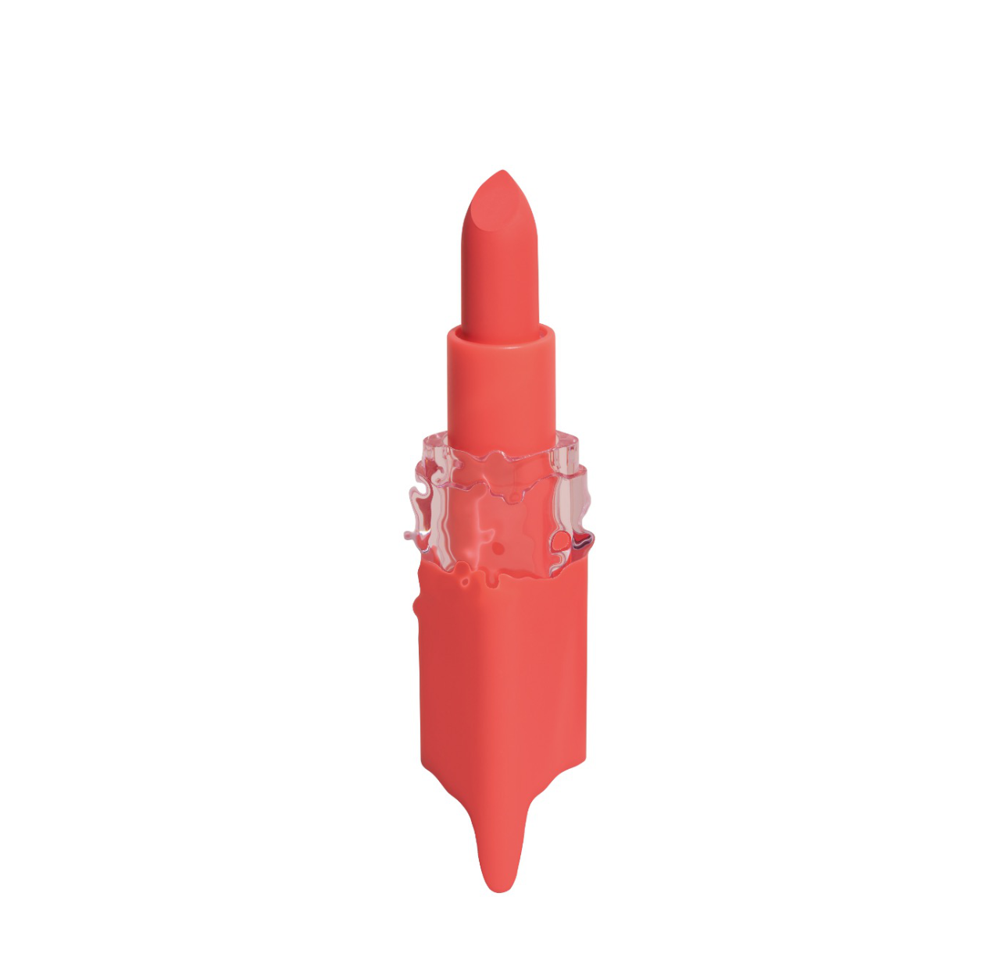

# Masking in Liquify Persona

Protect parts of an image from warp effects applied in Liquify Persona by applying a mask.

*Before and after liquify effect applied, with mask in place (shown in red).*

## Freezing areas to make a mask

There may be areas of your image which you want to protect from being warped by the Liquify tools. You can do this by 'freezing' those areas using the Liquify Freeze Tool. Frozen areas can be thawed using the Liquify Thaw Tool, if you wish them to be subject to warps once more.

**To apply a mask:**

Do one of the following:

- With the **Liquify Freeze Tool** selected, drag on the page to select areas to be masked.
- On the Toolbar, select **Mask All** to apply a mask to the entire image.

**To remove areas of a mask:**

Do one of the following:

- With the **Liquify Thaw Tool** selected, drag on the page to remove areas from a mask.
- On the Toolbar, select **Clear Mask** to remove a mask entirely from the image.

**To invert masked areas:**

- On the Toolbar, select **Invert Mask**.

> **Tip:** To mask (or freeze) large areas of your image, do one of the following:
>
> - On the Toolbar, select **Mask All** and then use the **Liquify Thaw Tool** to remove parts of the mask.
> - Use the **Liquify Freeze Tool** to select areas *to be warped* and then on the Toolbar, select **Invert Mask**.

#### SEE ALSO:

- [Mask panel](04-mask-panel.md)
- [Warping using Liquify Persona](01-warping-using-liquify-persona.md)
