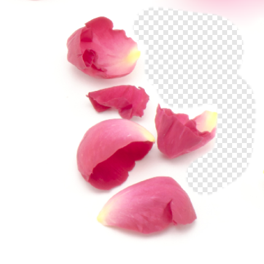
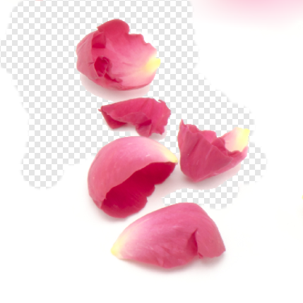
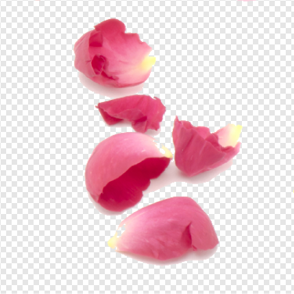

# Erasing

Affinity Photo 2 lets you erase areas of a layer using a combination of the [Erase Brush Tool](../32-tools/06-erase-tools/01-erase-brush-tool.md), the Brushes panel and the tool's context toolbar. Alternatively, you can use the [Background Erase Brush Tool](../32-tools/06-erase-tools/02-background-erase-brush-tool.md) or the [Flood Erase Tool](../32-tools/06-erase-tools/03-flood-erase-tool.md) to remove pixels from a layer.

*Use of Erase Brush Tool, Background Erase and Flood Erase Tools.*

## Erasing on a layer

You can use the Erase Brush Tool to erase unwanted pixels directly on the layer using the same principles as using the [Paint Brush Tool](01-painting-brush-strokes.md).

The Background Erase Brush Tool takes a sample of the color under the cursor when you begin to erase, and will remove all closely matching colors along the stroke.

The Flood Erase Tool removes areas of the layer based on the color selected using a powerful tolerance setting.

### Erasing on a vector layer

As pixels don't exist on a vector layer, a pixel mask is created and applied over the vector layer instead; the erasing process prevents the shape, line or text from being modifiable from that point forward. However, the pixel mask can be modified at any point using pixel brushes. See [Layer masks](../06-layers/12-layer-masks.md) for more details.

> **Note:** The Flood Erase Tool cannot be used on a vector layer.

**To erase on a pixel layer:**

1. From the **Layers** panel, select a pixel layer.
2. From the **Tools** panel, select the **Erase Brush Tool**.
3. From the **Brushes** panel, select a brush of your choice.
4. Adjust the context toolbar settings.
5. Drag on the page in the direction that you want the erase brush stroke to follow.

**To use the Background Erase Brush Tool:**

1. From the **Layers** panel, select a layer. (If you select a vector layer, it will be automatically rasterized when the tool is used.)
2. From the **Tools** panel, select the **Background Erase Brush Tool**.
3. From the **Brushes** panel, select a brush of your choice.
4. Adjust the context toolbar settings.
5. Place the cursor over the color you want to erase in the image and drag within the image to erase the targeted color beneath the brush cursor.

**To use the Flood Erase Tool:**

1. From the **Layers** panel, select a pixel layer.
2. From the **Tools** panel, select **Flood Erase Tool**.
3. Adjust the context toolbar's **Tolerance** setting to control the extent of flood erasing across pixels. Experimenting will produce labor saving results.
4. Click on the image to select the target pixel.

**To erase on a vector layer:**

1. From the **Layers** panel, select the vector layer.
2. From the **Tools** panel, select the **Erase Brush Tool**.
3. Paint on the vector layer to erase.

You'll notice a mask thumbnail appear next to the layer. While this remains selected you can continue erasing.

> **Note:** A layer mask is added by default, however, using the [Assistant](../37-settings-preferences/01-settings-preferences.md) you can control how pixel erasing works on vector layers. You can optionally rasterize the layer completely or take no action (preventing erasing from occurring).

#### SEE ALSO:

- [Painting brush strokes](01-painting-brush-strokes.md)
- [Erase Brush Tool](../32-tools/06-erase-tools/01-erase-brush-tool.md)
- [Brushes panel](../33-panels/05-brushes-panel.md)
- [Background Erase Brush Tool](../32-tools/06-erase-tools/02-background-erase-brush-tool.md)
- [Flood Erase Tool](../32-tools/06-erase-tools/03-flood-erase-tool.md)
