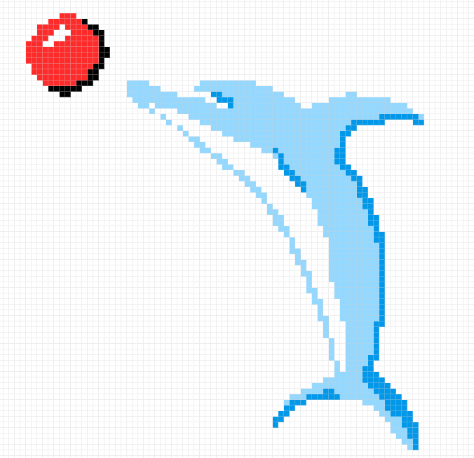

# Pixel-aligned painting

To achieve hard-edged painted strokes, which align to individual pixels, you can use the Pixel Tool.

The Pixel Tool adds pixels directly to the layer using the same principles as using the [Paint Brush Tool](01-painting-brush-strokes.md).

**To apply pixel brush strokes:**

1. Use the **Layers** panel to select the layer that you want to work on, or create a new layer.
2. From the **Tools** panel, select the **Pixel** tool.
3. From the **Brushes** panel, select a brush thumbnail of your choice. Use hard-edged brushes from the Basic category for best results.
4. Adjust the context toolbar settings.
5. Select a stroke color from the **Color** panel.
6. Drag on the page in the direction that you want the brush stroke to follow.

> **Note:** Although the Pixel Tool will align to pixels by design, switching on a one-pixel fixed grid may help stroke alignment.

> **Note:** The keyboard modifiers available to the Paint Brush Tool apply equally to the Pixel Tool.

**To smooth brush strokes as you paint:**

- On the context toolbar, enable the **Stabilizer** option and choose one of the following:
  - **Rope mode**—drag the stroke end by a 'rope' that smooths the stroke but lets you introduce sharp corners at increasing **Length** (radius) values by redirecting the slackened rope.
  - **Window mode**—smooths the stroke by averaging the stroke's position over a **Window** whose size is configurable.

#### SEE ALSO:

- [Pixel Tool](../32-tools/05-paint-tools/03-pixel-tool.md)
- [Painting brush strokes](01-painting-brush-strokes.md)
- [Grids](../30-design-aids/15-grids.md)
