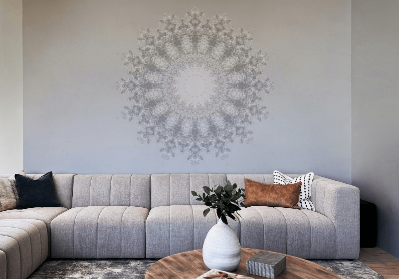

# Symmetry and Mirror

Use Symmetry and Mirror options while painting with the **Paint Brush Tool** to create controlled and pattern-like compositions.

## Symmetry painting

Using the **Symmetry** and **Mirror** options found on the Paint Brush Tool's context toolbar, you can create variable repeating patterns with radial or Mandala-style symmetry over one, or multiple planes.

*Mirrored brush strokes applied to create a pattern.*

**To create symmetrical and mirrored effects:**

1. From the Tools panel, select the **Paint Brush Tool**, then consider the following:
  - Enabling the **Symmetry** option from the context toolbar allows you to produce symmetrical or mirrored drawings over one or multiple planes.
  - Rotate the symmetry plane about the center of the drawing by dragging from anywhere along the primary symmetry line. Pressing the `Shift`  will make the line snap to 15° intervals.
  - Click the **Lock** setting to lock the symmetry line in place. With the setting unchecked, you can reposition the symmetry origin and draw symmetrical and mirrored patterns elsewhere on the page.
  - Use the live brush preview to see the direction of the symmetrical brush strokes. If the direction needs to be mirrored, check the **Mirror** option on the context toolbar.
  - If you wish to work with more than one plane of symmetry, click the field value box next to **Symmetry** and adjust the number of planes. You can use up to 16 planes in total.
2. Paint on the page.

*A dreamcatcher design with a symmetrical pattern.*

*A dreamcatcher design with a mirrored pattern.*

**To reposition the symmetry origin:**

- Drag the symmetry origin to reposition it on the page.

> **Preferences — Settings (or Preferences):** Related behaviors can be adjusted from [the app's settings](../37-settings-preferences/01-settings-preferences.md):
>
> - **Miscellaneous>Reset Fills**
> - **Miscellaneous>Reset Brushes**
> - **User Interface>Show brush previews**
> - **User Interface>Always show brush crosshair**

#### SEE ALSO:

- [Paint Brush Tool](../32-tools/05-paint-tools/01-paint-brush-tool.md)
- [Brushes panel](../33-panels/05-brushes-panel.md)
- [Modifying brush strokes](06-modifying-brushes.md)
- [Keyboard shortcuts for painting operations](../36-keyboard-shortcuts/01-keyboard-shortcuts.md)
