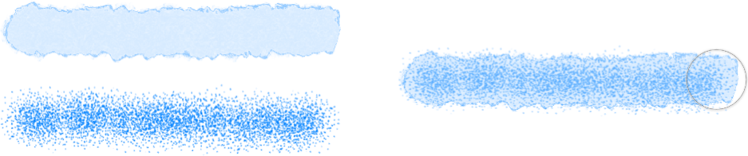

# Multi-brushes

This feature allows any brush to have one or more additional *sub-brushes* attached to it. The sub-brushes will draw over the top of the base brush as the stroke is applied.

*Single brush strokes (left) and multi-brush stroke equivalent (right).*

## About multi-brushes

This feature is intended to introduce more nib variety, randomness and character to your brush stroke appearance (avoiding repetitive texture tiling) so the results are more varied and natural. Each sub-brush can have a fully separate and customizable set of dynamics. You can control where the sub-brushes are drawn on the stroke and how they blend with the main brush.

Sub-brushes can be created from an existing brush or as a new brush by accessing the **Sub Brushes** tab in the Brush - Editing dialog (double-click a pixel brush in the panel to view). You can drag and drop existing brushes from the same **Brushes** panel category directly into the tab's **Sub Brushes** list. Change the order in which they are added to the main brush by dragging them up or down in the list.

**macOS:**

> **Note:** For best performance, use Metal acceleration (if available).

**Windows:**

> **Note:** For best performance, use a computer with high-end QuadCore CPUs (or better).

**To create a multi-brush:**

1. On the **Brushes** panel, create a main brush or duplicate a selected brush.
2. Select the new brush and click **Edit Brush**.
3. Click the **Sub Brushes** tab.
4. Click **Add Bitmap**, select a nib file for your sub brush and click **Open**.
5. Double-click the brush entry appearing in the window to launch the Sub-Brush Editor.
6. Edit the sub-brush settings as you would for your base brush, then click **Close**.
7. In the Brush Editing dialog, change sub-brush settings to control:
  - **Drawing**—controls where the sub-brush is drawn in relation to the main brush.
  - **Blending**—controls how the sub-brush blends with the main brush.
  - **Sync size**—when checked, sets the default width of the stroke to match that of the main brush.
  - **Sync spacing**—when checked, sets the distance between each nozzle point to match that of the main brush.

**To create a sub-brush from an existing brush do the following:**

1. On the **Brushes** panel, double-click the brush you'd like to modify.
2. On the pop-up dialogue, switch to the **Sub Brushes** tab.
3. (Optional) Select **Add Bitmap** if you would like to create a sub-brush based on an image texture or **Add Round** should you wish to add a rounded nozzle brush, respectively.
4. (Optional) From the **Brushes** panel, drag another brush you would like to base your sub-brush on.

> **Note:** You can add additional sub-brushes with the topmost sub-brush affecting the lower sub-brush, and the resulting stroke affecting the main brush. Sub-brushes can be reordered by dragging within the Sub Brushes window.

#### SEE ALSO:

- [Paint Brush Tool](../../32-tools/05-paint-tools/01-paint-brush-tool.md)
- [Brushes panel](../../33-panels/05-brushes-panel.md)
- [Modifying pixel brushes](../06-modifying-brushes.md)
- [Keyboard shortcuts for painting operations](../../36-keyboard-shortcuts/01-keyboard-shortcuts.md)
