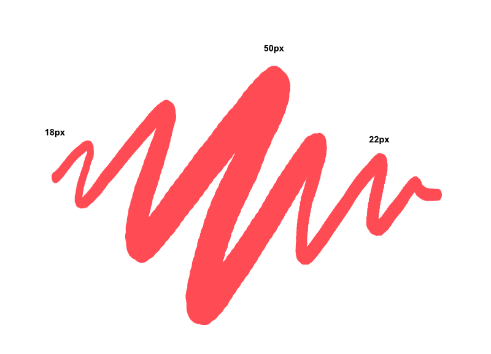

# Modifying brushes

Brushes can be modified before you paint on your design. Basic modifications can be made from the context toolbar, while advanced adjustments can be made from the **Brushes** panel. Both methods set brush properties for subsequent brush strokes, but the latter edits your brush permanently.

Width (Size)

Accumulation

Hardness

Spacing

Flow

Shape

Rotation

### Settings (or Preferences)

The following settings are available via **More** on the context toolbar:

#### General

- **Size**—sets the default width of the stroke. This can still be overwritten for individual brush strokes using the context toolbar.
- **Accumulation**—sets the deviation in the opacity or visibility of the stroke as it is painted.
- **Hardness**—how hard the edges of the brush are. The brush appears softer as the percentage decreases.
- **Spacing**—sets the distance between each nozzle point. A lower percentage results in the nozzles blending together to give a flowing stroke. A higher percentage pushes nozzles away from each other creating a spray-style stroke.
- **Flow**—controls how fast color is built up under your brush.
- **Shape**—sets the diameter of the brush nozzles.
- **Rotation**—sets the angle at which the brush nozzles are drawn. Great for non-round brushes, e.g. for calligraphic effects.
- **Blend Mode**—changes how the applied color interacts with existing colors on a layer. Select from the pop-up menu.
- **Wet edges**—sets the default 'wet edge' behavior of the brush. Select from the pop-up menu. Check **Custom** and apply a preset or custom profile, which subtly changes how watery the stroke appears.  
 The 'wet edge' behavior builds paint up along the edges of your pixel brush stroke, producing a watercolor effect.
- **Associated Tool**—sets the tool which is automatically selected when the brush is selected. Select from the pop-up menu. The associated tool's icon will appear next to the brush on the Brushes panel.

#### Dynamics

- Jitter settings determine the extent to which a chosen controller (Pressure, Velocity, Rotation, etc.) will affect the above General settings. Pick a controller from the pop-up menu and click the adjacent Ramp profile icon to select a standard profile from lower thumbnails or create your own using the ramp chart. Move circular nodes to reshape the ramp, add nodes to the ramp by clicking on the line, or select a node to delete a node with the `Backspace`  (simplifying the ramp). Check **Linear** for straight lines between all nodes; If unchecked (non-linear), nodes are connected using smooth curves.
- **Scatter X**—sets the deviation in the horizontal position of the stroke the preset will allow as a stroke is painted.
- **Scatter Y**—sets the deviation in the vertical position of the stroke the preset will allow as a stroke is painted.

> **Note:** Hue, Saturation, and Luminosity Jitter settings affect the brush color, which is set via the **Color** panel. Similarly, Flow Jitter affects brush opacity, also set on the Color panel.

#### Texture

For nozzle control:

- **Brush Nozzles**—displays the nozzles currently used in the current brush.
- **Add**—adds an additional nozzle to the preset.
- **Remove**—deletes the selected nozzle from the preset.
- Nozzle-specific controller (Pressure, Velocity, Rotation, etc.)—For multi-nozzle brushes, pick a controller from the pop-up menu and click the adjacent Ramp profile icon to select a standard profile from lower thumbnails or create your own using the ramp chart.
- **Interpolate**—when checked, the quality of the brush tip is improved when affected by the currently set brush tip controller option.

For base texture control:

- **Base Texture**—displays the underlying texture or pattern for the current brush.
- **Set Texture**—launches a dialog to add a base texture, as an image, to the brush. For example, to simulate a textured surface like paper or canvas.
- **Remove**—deletes the base texture from the current brush.
- **Invert**—creates a negative version of the texture.
- **Mode**—controls how the base texture contributes to the current brush. Select from the pop-up menu.
  - **None**—the base texture is ignored, so only the brush nozzles are used.
  - **Nozzle**—allows nozzles to build up brush color onto the base texture depending on flow and opacity response.
  - **Final**—the density of the base texture is kept constant, with no nozzle flow or opacity response.
- **Scale**—sets the size at which the texture is displayed. A lower percentage will display the texture at a larger size. A higher percentage will display the texture tiled at a smaller size.

> **Note:** Images for base textures should be JPEG or PNG. Any reasonably sized image will be acceptable as the base texture can be scaled (above). We recommend using an 8bit grayscale image with a size greater than or equal to 1024 x 1024 pixels. 16bit brushes will generally be slower with no appreciable increase in quality but can also be used.

#### Sub Brushes

- **Drawing**—controls where the sub brush is drawn in relation to the main brush.
- **Blending**—controls how the sub brush blends with the main brush.
- **Sync size**—when checked, sets the default width of the stroke to match that of the main brush.
- **Sync spacing**—when checked, sets the distance between each nozzle point to match that of the main brush.

#### Additional settings:

- **Reset**—returns all stroke settings to those of the saved brush preset.
- **Duplicate**—saves the current stroke settings to a new preset.
- **Close**—exits the dialog and applies stroke settings to the selected preset.

**To modify brush settings:**

1. Do one of the following:
  - With the Paint Brush Tool selected, on the context toolbar, click **More**.
  - On the **Brushes** panel, -click the brush you would like to modify and select **Edit Brush**.
  - On the **Brushes** panel, double-click the brush you would like to alter.
2. Adjust the settings in the dialog.
3. Click **Close**.

> **Note:** For more information on creating custom brush presets, see the [Creating custom brushes](05-creating-custom-brushes.md) topic.

**To rename a brush:**

1. Do one of the following:
  - On the **Brushes** panel, click **Edit Brush**.
  - With the Paint Brush Tool selected, on the context toolbar, click **More** and then **Save As** in the pop-up dialog.
  - On the **Brushes** panel, -click the brush you would like to rename and select **Edit Brush**.
  - On the **Brushes** panel, double-click the brush you would like to rename.
  - On the **Brushes** panel, -click the brush you would like to rename and select **Rename Brush**.
2. Enter the new name for the brush.
3. Press `Return` to confirm.
4. Click **Close** or **OK** in the dialog, depending on the option from those listed above.

**To load a bitmap to a brush stroke:**

1. Select the **Paint Brush Tool**.
2. On the **Brushes** panel, select a brush.
3. Do one of the following:
  - **macOS:** From your Finder window, drag a bitmap file and drop it onto the **Swatches** panel, **Color** panel or the active color selector.
  - **Windows:** From your Explorer window, drag a bitmap file and drop it onto the **Swatches** panel, **Color** panel or the active color selector.
  - From the **Assets** panel, drag an asset, e.g. a texture, onto the **Swatches** panel, **Color** panel or the active color selector.
  - From the **Stock** panel, drag a photo onto the **Swatches** panel, **Color** panel or the active color selector.

Bitmap-loaded brushes are great for stamp-styled strokes, where a single click on the page places the loaded texture. They are often used in placing a watermark, e.g. the author's logo on digital artwork.

## Paint Brush Tool controller options

| Option | Device | Description |
| --- | --- | --- |
| Random | Tablet pen, mouse | The value of the attribute will be randomly determined based on the percentage of jitter set. The range of this jitter can be seen by the length of the blue bar in the **General** tab. |
| Pressure | Tablet pen | The appearance of the brush stroke will be affected by the amount of pressure applied to the tablet. |
| Angle | Tablet pen | The behavior of the brush stroke will be mapped to match the angle of the tablet pen (this varies from 0 to 360°). |
| Tilt | Tablet pen | The behavior of the brush stroke will be mapped to match the tilt of the tablet pen (this varies from 0 to 90°). |
| Rotation | Tablet pen 1, 2 | The behavior of the brush stroke will be mapped to match the tablet pen's barrel rotation. |
| Cyclic | Tablet pen, mouse | The behavior of the brush stroke will cycle between the range of available values shown on the slider. 3 |
| Velocity | Tablet pen, mouse | The appearance of the brush stroke will be modified as the speed of the tablet pen or mouse movement increases. The range of the jitter can be seen by the length of the blue bar with low velocity on the left and high velocity on the right. |
| Velocity Inverse | Tablet pen, mouse | The appearance of the brush stroke will be modified inversely as the speed of the tablet pen or mouse movement increases. The range of the jitter can be seen by the length of the blue bar with high velocity on the left and low velocity on the right. |
| Direction | Tablet pen, mouse | The appearance of the brush stroke will be affected by the direction the pen or mouse is moving in. |
| Stylus Wheel | Tablet pen 1 , 2 | The appearance of the brush stroke will change depending on the setting of the wheel on the airbrush pen. |
| Distance | Tablet pen, mouse | The appearance of the brush stroke will be affected by the length of the continuous stroke. |

1 This setting is only supported on certain Wacom tablet pens.

2 The Apple Pencil does not support this setting.

3 You will need to ensure the **Jitter** setting is sufficiently high enough for the effect to change.

#### SEE ALSO:

- [Painting brush strokes](01-painting-brush-strokes.md)
- [Creating custom brushes](05-creating-custom-brushes.md)
- [Creating multi-brushes](05-creating-custom-brushes/01-pixel-multibrushes.md)
