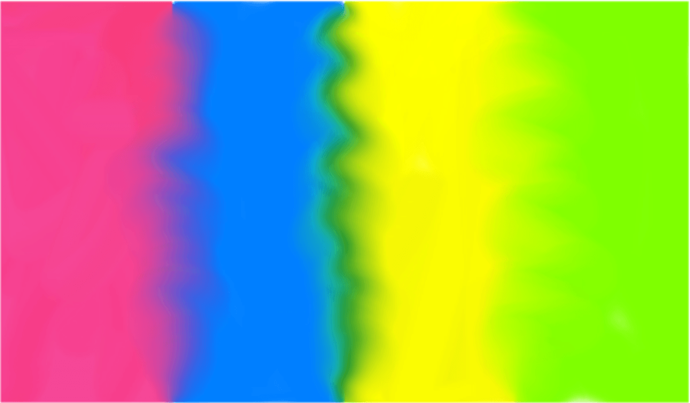

# Mixing paint colors

Affinity Photo 2 gives you the opportunity to digitally simulate the mixing of wet paint applied to a canvas.

*Effect of dragging the Paint Mixer Brush across color boundaries.*

## Using the Paint Mixer Brush

The **Paint Mixer Brush** is pre-loaded with the Foreground color selected on the Color panel. As you drag on the page, this color blends with the color of pixels underneath the stroke, giving a smudged appearance to the image.

By default, the mixed color remains on the Paint Mixer Brush. However, the brush can be manually 'cleaned' at any time. As soon as you drag on the page with a clean brush, the brush will pick up the color directly underneath it.

Alternatively, the mixed color can be manually removed from the brush at any time and reloaded with the Foreground color. You can also set this to occur automatically every time you begin a new stroke.

> **Note:** The **Paint Mixer Brush** only responds to the **Size** and **Rotation** options.

**To mix paints:**

1. On the **Tools** panel, select **Paint Mixer Brush**.
2. On the **Color** panel, set the Foreground color.
3. On the **Brushes** panel, select a brush type.
4. Adjust the context toolbar settings.
5. Drag on the page.

**To simulate a clean brush (with no paint on it):**

With the **Paint Mixer Brush** selected, do any of the following:

1. Set the Foreground color on the **Color** panel to **None**.
2. On the context toolbar, click **Clean Brush**

**To remove mixed paint and reload the Paint Mixer Brush:**

- With the **Paint Mixer Brush** selected, on the context toolbar, select **Load Brush**.

> **Tip:** To automatically reload the brush after each stroke, on the context toolbar, select the **Auto Load Brush** option. Similarly, to automatically clean the brush after each stroke, select **Auto Clean Brush**.

#### SEE ALSO:

- [Paint Mixer Brush](../32-tools/05-paint-tools/04-paint-mixer-brush.md)
- [Color panel](../33-panels/08-color-panel.md)
- [Brushes panel](../33-panels/05-brushes-panel.md)
