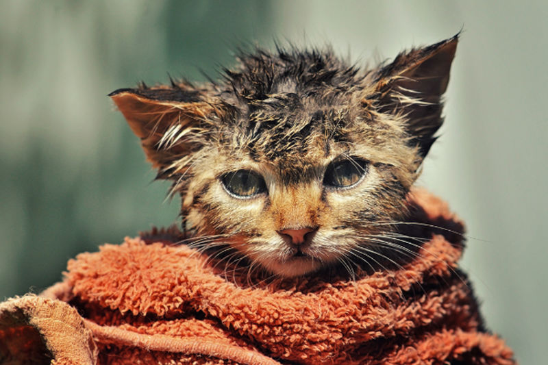
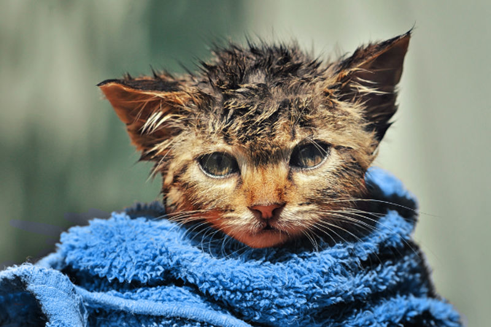

# Replacing colors by brush

You can recolor areas of an image using the Color Replacement Brush Tool.

*Before and after painting with the Color Replacement Brush Tool with the Foreground color set to blue.*

## Using the Color Replacement Brush Tool

The Color Replacement Brush Tool takes a sample of the color under the cursor when you begin to paint, and will replace all closely matching colors along the stroke with the current Foreground color. The targeted color's hue will be replaced with the current Foreground color's hue, while retaining saturation and lightness values of the original pixels.

**To replace colors by brush:**

1. From the **Layers** panel, select a layer. (If you select a vector layer, it will be automatically rasterized when the tool is used.)
2. From the **Tools** panel, select the **Color Replacement Brush Tool**.
3. From the **Brushes** panel, select a brush of your choice.
4. Adjust the context toolbar settings.
5. From the **Color** panel, choose a Foreground color to replace the color you want to change.
6. Drag the brush cursor over the targeted color.

#### SEE ALSO:

- [Color Replacement Brush Tool](../32-tools/05-paint-tools/02-color-replacement-brush-tool.md)
- [Brushes panel](../33-panels/05-brushes-panel.md)
- [Color panel](../33-panels/08-color-panel.md)
