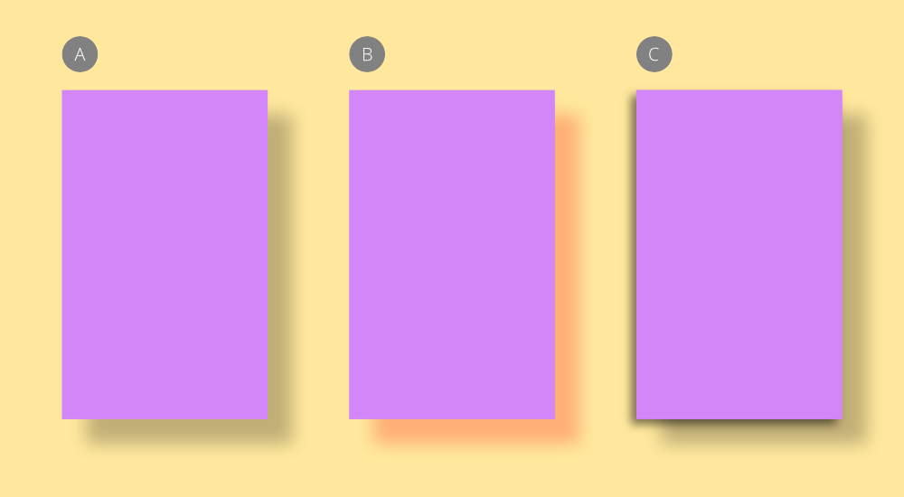

# Using layer effects

Layer effects can be applied to images, objects, shapes and text to add more creativity to your compositions.

*(A) Simple Outer Shadow layer effect using Quick FX panel, (B) a blended Outer Shadow using Layer Effects dialog and (C) multiple Outer Shadow effects using Layer Effects dialog.*

**Available layer effects:**

- [Bevel/Emboss](03-bevel-emboss.md)
- [Outline](11-outline.md)*
- [3D](02-3d-effect.md)
- [Inner Shadow](08-inner-shadow.md)*
- [Inner Glow](07-inner-glow.md)
- [Color Overlay](04-color-overlay.md)*
- [Gradient Overlay](06-gradient-overlay.md)*
- [Outer Glow](09-outer-glow.md)
- [Outer Shadow](10-outer-shadow.md)*
- [Gaussian Blur](05-gaussian-blur.md)

* Can be applied as multiple instances to the same object or layer.

> **Note:** The **Quick FX** panel isn't enabled by default. To enable it, navigate to **Window>Quick FX**.

Layer effects can be applied in two ways:

- Via the **Quick FX** panel, using a simplified set of more commonly used settings.
- Via the **Layers Effects** dialog, offering all settings plus the ability to create multiple instances of the same effect (for outline, shadows and overlays); effect instances can also be sorted to achieve different results.

For multi-instance effects, some examples include:

- Multiple outer shadows to simulate multi-directional multi-colored light sources.
- Multiple gradients with transparency tail-offs and blend modes.

> **Tip:** By working with duplicate layers, blend modes and masks, it's possible to obtain a great degree of control over the effects that you generate.

**To apply layer effects via the Quick FX panel:**

1. Select the layer(s) that you want to apply the effect to.
2. On the **Quick FX** panel, select the checkbox of the effect that you want to apply.
3. Adjust the settings as desired—options vary for each effect.
4. If required, select any other effects and adjust the settings.

> **Note:** When a layer has one or more effects applied, an  icon appears to the right of the layer’s name in the Layers panel.

> **Tip:** Many layer effects rely on setting a **Radius** value to see the effect initially applied.

**To apply layer effects via the Layer Effects dialog:**

1. Select the layer(s) that you want to apply the effect to.
2. Do any of the following:
  -  On the **Layers** panel, click **Layer Effects**.
  - Select **Layer>Layer Effects**.
3. (Optional)   Click **Duplicate effect** to create another instance of an outline, shadow or overlay effect; click **Delete effect** to remove any multi-instance effect.
4. Adjust the settings as desired—options vary for each effect.
5. If required, select any other effects and adjust the settings.

> **Tip:**   Use Move up or Move down to rearrange instances of a layer effect.

**To edit layer effects using the Quick FX panel:**

1. Select the layer that you want to edit.
2. On the **Quick FX** panel, choose the effect to expand the options you want to edit.
3. Adjust the settings as desired—options vary for each effect.
4. If required, repeat for any other effects.

**To edit layer effects using the Layer Effects dialog:**

1. Click the effects icon on the layer entry in the **Layers** panel.
2. In the dialog, click on the label of the effect that you want to edit.
3. Adjust the settings as desired—options vary for each effect.
4. If required, repeat for any other effects.

> **Tip:** If you create a set of layer effects that you want to use again you can save time and effort by saving them as a style to the Styles panel. This way they can be applied to any new layer with a single click.

> **Note:** For accurate preview of effects, ensure to apply them to pixel layers.

#### SEE ALSO:

- [Quick FX panel](../33-panels/20-quick-fx-panel.md)
- [Layers panel](../33-panels/13-layers-panel.md)
- [Styles](../25-lines-and-shapes/13-styles.md)
- [Styles panel](../33-panels/26-styles-panel.md)
- [Layer blending](../06-layers/05-layer-blending.md)
