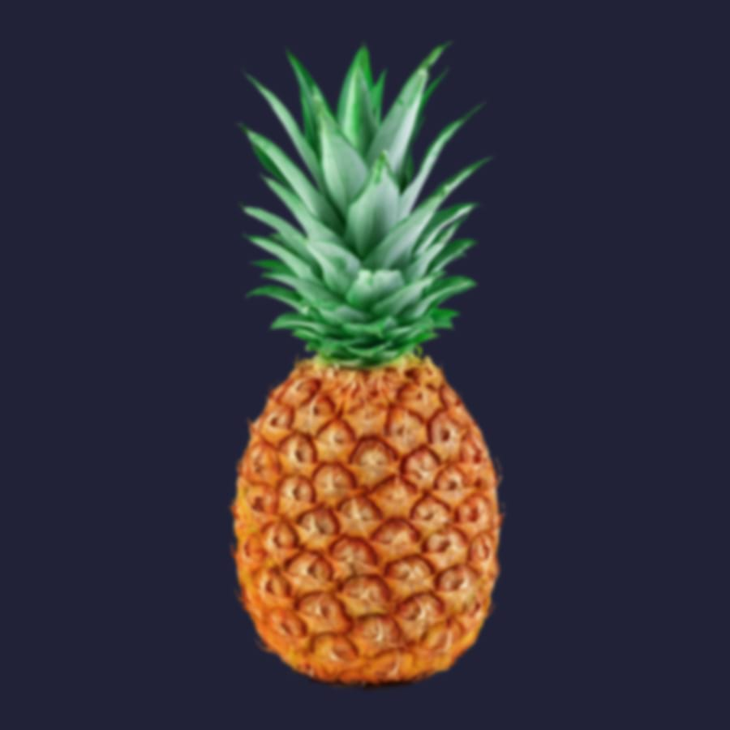

# Gaussian Blur

The Gaussian Blur effect is used to create a pleasing, smooth blur using a weighted average.

*Before and after effect applied.*

### Settings

The following settings are shown on the **Quick FX** panel:

- **Radius**—controls the extent of the effect.
- **Preserve Alpha**—when checked, object edges are not subject to blurring.

The following advanced settings can be adjusted in the **Layer Effects** dialog:

- **Scale with Object**—when selected, the effect scales in proportion to the layer contents if the content is resized. If this option is off, the effect's scale remains unchanged when the layer content is resized.
- **Fill Opacity**—sets the opacity of the layer contents without affecting the applied effects.

#### SEE ALSO:

- [Using layer effects](01-using-layer-effects.md)
- [Quick FX panel](../33-panels/20-quick-fx-panel.md)
