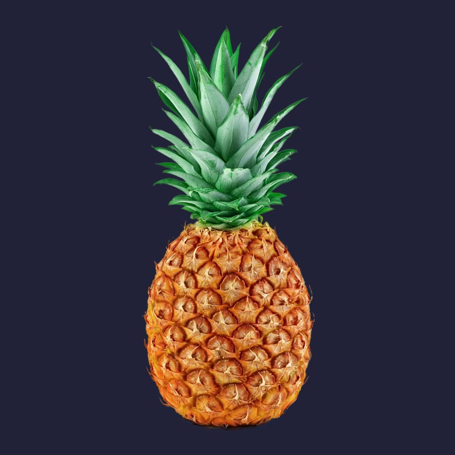
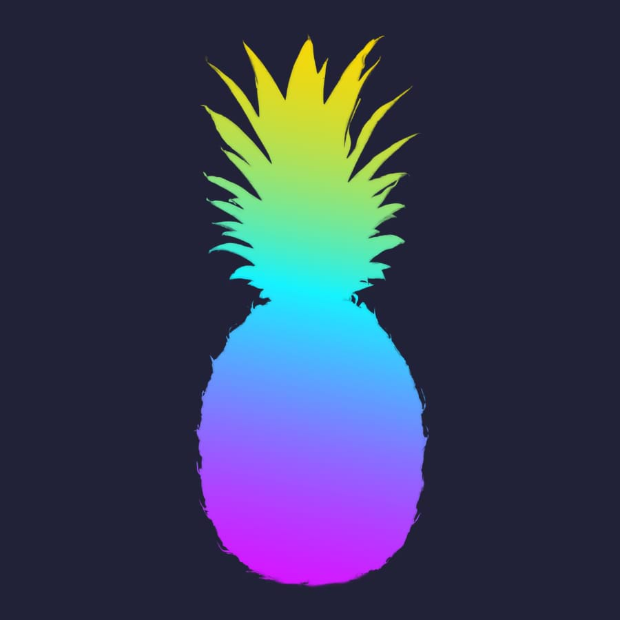

# Gradient Overlay

The Gradient Overlay effect is used to apply a grayscale or color gradient on top of any existing colors.

*Before and after effect applied.*

### Settings

The following settings are shown on the **Quick FX** panel:

- **Opacity**—Controls the transparency of the effect.
-  **Layer Effects**—provides access to the **Layer Effects** dialog for more advanced settings and controls.

The following advanced settings can be adjusted in the **Layer Effects** dialog:

- **Type**—determines the gradient type used. Select from the pop-up menu.
- **Gradient**—sets the grayscale or color gradient. Click the gradient thumbnail to edit.
- **Scale**—defines the spread of the gradient separately for the X (horizontal) and Y (vertical) axes.
- **Offset**—defines the start and end stops of the gradient. This is set separately for the X (horizontal) and Y (vertical) axes.
- **Angle**—defines the direction of the light source, shadow or gradient.
- **Scale with Object**—when selected, the effect scales in proportion to the layer contents if the content is resized. If this option is off, the effect's scale remains unchanged when the layer content is resized.
- **Fill Opacity**—sets the opacity of the layer contents without affecting the applied effects.

#### SEE ALSO:

- [Using layer effects](01-using-layer-effects.md)
- [Color Overlay](04-color-overlay.md)
- [Gradient and bitmap fills](../12-color/08-gradient-and-bitmap-fills.md)
- [Quick FX panel](../33-panels/20-quick-fx-panel.md)
