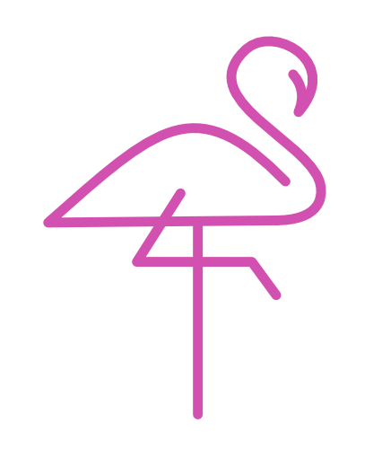
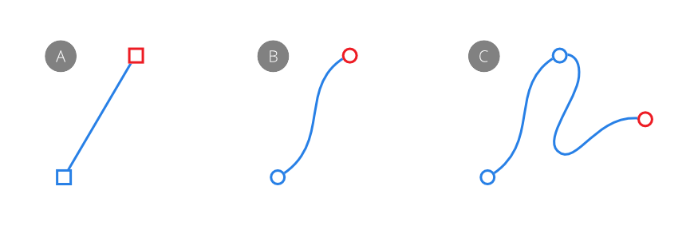
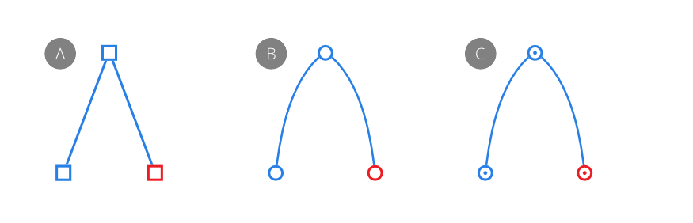
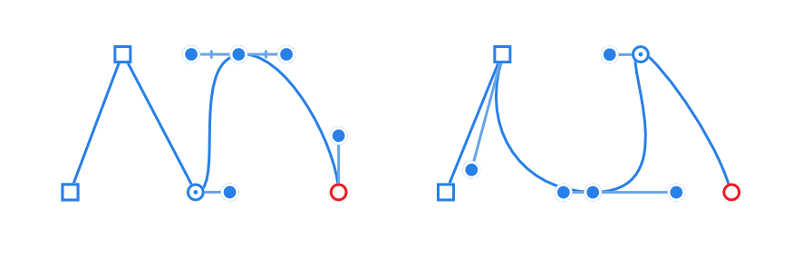

# About lines and shapes

When you want to draw vector lines and shapes you'll need to use the [Pen](../32-tools/02-vector-line-tools/01-pen-tool.md) and [shape](07-draw-and-edit-shapes.md) tools. Editing lines and shapes is done with the [Node](../32-tools/02-vector-line-tools/02-node-tool.md) Tool or the `Cmd`  as you draw.

*An example of combined vector lines and shapes.*

## Lines

A line has distinct start and end stops, called nodes, with one or more nodes placed along the line's length which delimit each line segment and the segment's shape.

*Segments between nodes can be straight (A) or curved (B). Multiple segments make up more complex curves (C).*

The type of node controls how the curve is shaped between segments. There are three basic types of node:

- Sharp (A)—curve abruptly changes direction at the node creating a sharp non-symmetrical corner.
- Bézier (B)—curve is smooth at the node (controllable by control handles; not shown).
- Smart (C)—curve is symmetrical using a line of best fit at the node.

When drawing curves, any combination of nodes can be used to create the desired curve.

For Smart and Bézier curves, each node has one or two control handles when drawn. For Bézier curves, the length and slope of the control handles determine the shape of the line segment; Smart curves automatically set the control handle position to form a best fitting curve through the node.

> **Preferences — Settings (or Preferences):** Related behaviors can be adjusted from [the app's settings](../37-settings-preferences/01-settings-preferences.md):
>
> - **User Interface>Show Lines in points**

## Shapes

A shape is a closed curve—it has no discernible start or end—made up of multiple curves.

You can also easily create geometric type shapes using the [shape](07-draw-and-edit-shapes.md) tools. These have special properties that enable you to quickly create otherwise difficult to draw shapes, such as circles, rectangles and polygons.

> **Note:** Curves and closed shapes can be given stroke and fill properties.

#### SEE ALSO:

- [Edit vector lines and shapes](03-edit-vector-lines-and-shapes.md)
- [Draw and edit shapes](07-draw-and-edit-shapes.md)
