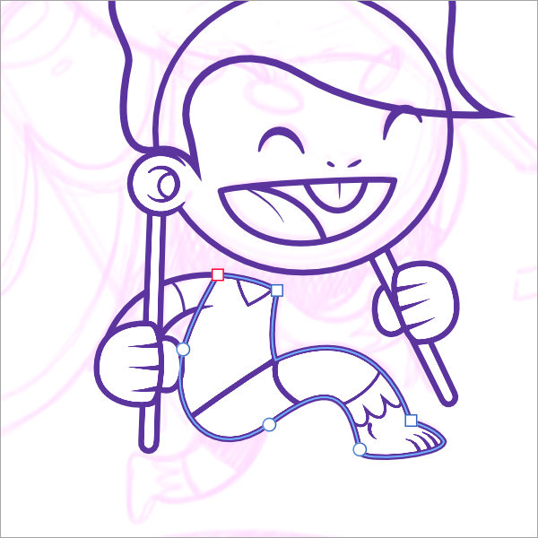

# Draw curves and shapes

Curves and shapes are easily created using the Pen Tool. The Pen Tool has several modes that change the way the path is drawn.

**To draw precise curves with the Pen Tool:**

1. Select the **Pen Tool**.
2. On the context toolbar, select a **[Mode](../32-tools/02-vector-line-tools/01-pen-tool.md)**:
  -  **Pen Mode**—click-drag on the page to create repeated nodes; repositioning the displayed off-curve control handles at each node defines the shape of the next segment as you lay down nodes.
  -  **Smart Mode**—click repeatedly on the page to lay down each node; a best fitting curve is created without need for control handle adjustment.
  -  **Polygon Mode**—click repeatedly on the page to lay down each node; a line is created with sharp nodes made up of straight segments.
  -  **Line Mode**—click and drag on the page to create a simple single-segment straight line that self-terminates.
3. Enable **Use line style** to edit the outer line of the shape drawn via the **Stroke** panel, or **Use fill** to automatically fill the concave area created by the curve with the current fill color.
4. To complete the curve without closing it, press the `Esc` . To close the curve, click on the starting node.

> **Note:** To draw a straight line of a specific rotation and/or length, with a single uncurved line selected using the **Move Tool**, on the **Transform** panel, adjust the **Rotation** and/or **Length** values.

> **Note:** Other context toolbar options can be used *in conjunction* with any one of the four modes above:
>
> -  **Preserve Selection When Creating New Curves**—when enabled, it keeps the previously drawn curve(s) selected so that their nodes and geometry can be more easily snapped to as you draw.
> -  **Add New Curve to Selected curves object**—when enabled, the mode creates additional curves on the same layer as the initial curve—this gives better management of a multitude of curve layers. For example, the character 'a' is made up of two curves that can be a single 'curve object'. From **Layer>Geometry**, choose **Separate Curves** to separate each curve into separate layers or **Merge Curves** to consolidate selected curves into one layer.
> - **macOS:**  **Rubber Band Mode**—when enabled, it previews the next segment to be drawn before placement of the new leading node. Use with `Ctrl`  pressed for straight-line segment previews.
> - **Windows:**  **Rubber Band Mode**—when enabled, it previews the next segment to be drawn before placement of the new leading node.

A number of cursor types may appear when using this tool, indicating the outcome of the next click.

| Cursor type | Description |
| --- | --- |
|  | Asterisk—creates a new curve |
|  | Plus—creates a new node and curve segment |
|  | Slope—converts to sharp corner or drag to recreate node |
|  | Circle—creates a closed shape |
|  | Circled asterisk—creates a new curve from an existing curve’s node. |
|  | Circled plus—creates a new node overlapping an existing curve’s node. |

**To continue an existing curve:**

1. Press the `Cmd`  to edit curve or select the curve with the **Node Tool**.
2. Place the cursor over the final node on the path that you want to continue.
3. Click once to select the node.
4. Release the `Cmd`  (or select **Pen Tool**) and click/drag to place new nodes as needed. This can be placed over an existing node on the same curve, creating coincidental overlapping nodes.

**To change a curve or shape's stroke width:**

Do one of the following:

- On the Pen Tool context toolbar's **Stroke properties**, adjust the **Width** via slider or input absolute values, expressions and formulas (percentages).
- Use the [ or ] s (decrease or increase width, respectively) as you draw or edit a curve.

**To close curves to create a custom shape:**

Do one of the following:

- With the curve selected with the **Pen** or **Node Tool**, click **Close Curve** on the context toolbar.
- When creating the curve with the Pen Tool, click on the starting node to join it to the final node and create the shape.

> **Note — Modifier keys:** When using the Pen Tool, the following modifier s can be used to speed up the workflow as you draw:
>
> - The `Cmd`  temporarily activates the Node Tool.
> - The `Shift`  constrains control handles to 45° intervals in Pen Mode. In Smart Mode, node positioning is constrained instead.
> - The `Alt`  forces the node into cusp mode.
> - Pressing the `Spacebar` while clicking and dragging lets you reposition the last drawn node without affecting control handle position which maintains curvature in and out of the node.
>
> For Pen Tool, Node and shape tools, the following modifier s can be used as you draw or when editing the object:
>
> - To decrease or increase stroke width by percentage, use the [ or ] s, respectively. For smaller absolute increments instead, use an additional `Shift`  modifier.

#### SEE ALSO:

- [Draw and edit shapes](07-draw-and-edit-shapes.md)
- [Edit vector line and shapes](03-edit-vector-lines-and-shapes.md)
- [Arrowheads](09-arrowheads.md)
- [Dot/dash line styles](10-dot-dash-line-styles.md)
- [Pen Tool](../32-tools/02-vector-line-tools/01-pen-tool.md)
- [Node Tool](../32-tools/02-vector-line-tools/02-node-tool.md)
- [Pressure sensitivity](15-pressure-sensitivity.md)
- [Keyboard shortcuts for vectors](../36-keyboard-shortcuts/01-keyboard-shortcuts.md)
