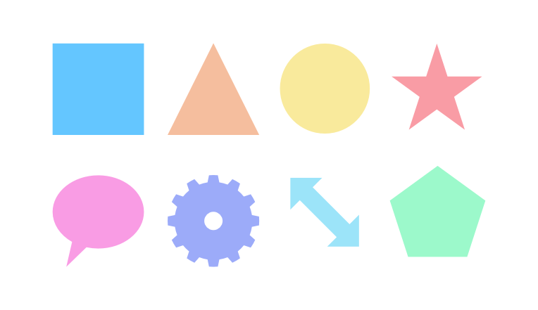

# About geometric shapes

Most geometric shapes, such as squares, circles and polygons, are difficult to draw accurately freehand. We've provided a selection of useful shapes to help you solve this problem. The shapes are fully geometrically correct, customizable, and can even be [converted to curves](12-converting-to-curves.md) for additional editing.

Once created, the shapes are easy to modify by changing the properties on the context toolbar or by dragging the special red handles. When hovered over, the direction in which they can be dragged is indicated by the pointer and/or a horizontal line.

**Available shapes:**

- [Rectangle Tool](../32-tools/08-vector-shape-tools/01-rectangle-tool.md)
- [Ellipse Tool](../32-tools/08-vector-shape-tools/02-ellipse-tool.md)
- [Rounded Rectangle Tool](../32-tools/08-vector-shape-tools/03-rounded-rectangle-tool.md)
- [Triangle Tool](../32-tools/08-vector-shape-tools/04-triangle-tool.md)
- [Diamond Tool](../32-tools/08-vector-shape-tools/05-diamond-tool.md)
- [Trapezoid Tool](../32-tools/08-vector-shape-tools/06-trapezoid-tool.md)
- [Polygon Tool](../32-tools/08-vector-shape-tools/07-polygon-tool.md)
- [Star Tool](../32-tools/08-vector-shape-tools/08-star-tool.md)
- [Double Star Tool](../32-tools/08-vector-shape-tools/09-double-star-tool.md)
- [Square Star Tool](../32-tools/08-vector-shape-tools/10-square-star-tool.md)
- [Arrow Tool](../32-tools/08-vector-shape-tools/11-arrow-tool.md)
- [Donut Tool](../32-tools/08-vector-shape-tools/12-donut-tool.md)
- [Pie Tool](../32-tools/08-vector-shape-tools/13-pie-tool.md)
- [Segment Tool](../32-tools/08-vector-shape-tools/14-segment-tool.md)
- [Crescent Tool](../32-tools/08-vector-shape-tools/15-crescent-tool.md)
- [Cog Tool](../32-tools/08-vector-shape-tools/16-cog-tool.md)
- [Cloud Tool](../32-tools/08-vector-shape-tools/17-cloud-tool.md)
- [Callout Rounded Rectangle Tool](../32-tools/08-vector-shape-tools/18-callout-rounded-rectangle-tool.md)
- [Callout Ellipse Tool](../32-tools/08-vector-shape-tools/19-callout-ellipse-tool.md)
- [Tear Tool](../32-tools/08-vector-shape-tools/20-tear-tool.md)
- [Heart Tool](../32-tools/08-vector-shape-tools/21-heart-tool.md)
- [Spiral Tool](../32-tools/08-vector-shape-tools/22-spiral-tool.md)

#### SEE ALSO:

- [Draw and edit shapes](07-draw-and-edit-shapes.md)
- [Converting to curves](12-converting-to-curves.md)
- [Snapping](../30-design-aids/11-snapping.md)
