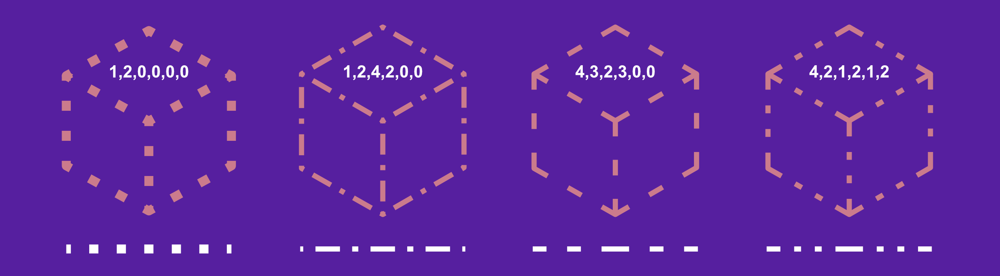
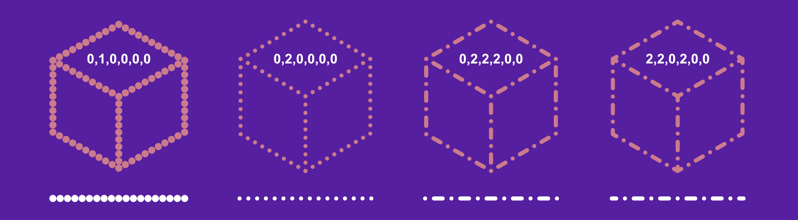
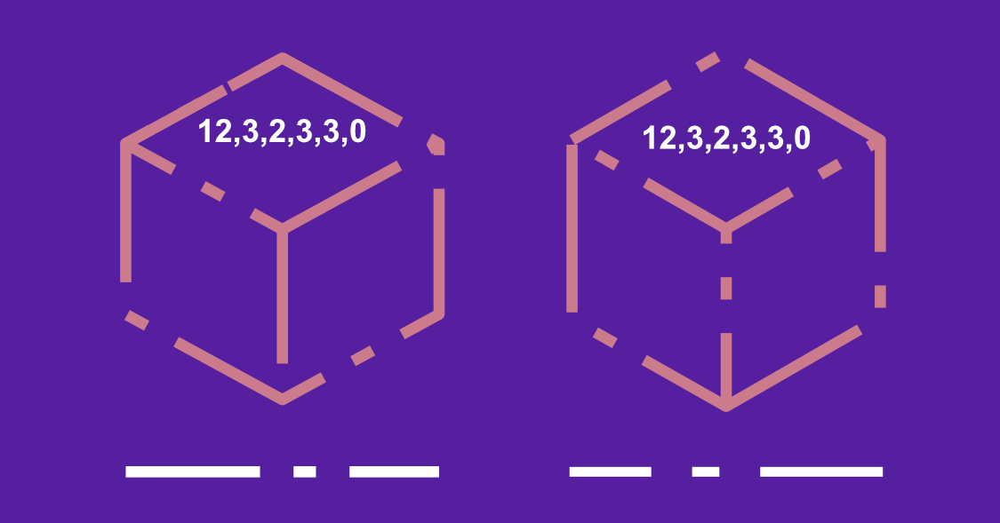

# Dot/dash line styles

Dot and dash line styles can be applied to objects as strokes and further customized to create a variety of different patterns.

## About dot/dash line styles

**Stroke properties** on the **Pen Tool**'s or shape tool's context toolbar let you change your stroke into a dotted or dashed line. For either, the **Dash Pattern** controls appear when the Dash Line Style is set.

A section of the panel sets the line's pattern using three number pairs:

- The first two **dash** and **gap** values set the length of the initial dot/dash and subsequent space, respectively. This gives a uniform pattern. Ensure the third/fourth and fifth/sixth pairs are set to 0 (as shown above).
- The third/fourth and fifth/sixth pair values, when set, introduce a more complex pattern by setting a different size for additional dots/dashes and spaces.

To configure, you can enter values directly or drag the dash (white) or gap (black) strips under the number sequence to the left or right to adjust in 0.1 increments.

 When enabled, **Balanced Dash Pattern** applies the pattern to the shape's outline so it appears seamless along the outline and is symmetrical at all corners. When **Balanced Dash Pattern** is disabled, you can set the **phase** value to manually 'shift' the dot/dash line style along so the design begins at a different point in the style's sequence.

> **Note:** You can choose between dots or dashes by setting the **Cap** type in **Stroke properties**. Use **Round Cap** for dots and rounded dashes, **Butt Cap** for squared dashes.

> **Note:** All values are based on the current line width, e.g. a value of 2 is twice the line width.

*Dashed line style with **Butt Cap** and **Balanced Dash Pattern** enabled.*

*Dotted and dashed line style with **Round Cap** and **Balanced Dash Pattern** enabled. The value 0 shows as a dot because it is zero length and formed from a pair of round caps.*

*Dashed line style with **Butt Cap** enabled, **Balanced Dash Pattern** disabled and **Phase** settings **0** (left) and **2** (right), respectively.*

#### SEE ALSO:

- [Pen Tool](../32-tools/02-vector-line-tools/01-pen-tool.md)
- [Node Tool](../32-tools/02-vector-line-tools/02-node-tool.md)
- [Pressure sensitivity](15-pressure-sensitivity.md)
- [Keyboard shortcuts for vectors](../36-keyboard-shortcuts/01-keyboard-shortcuts.md)
