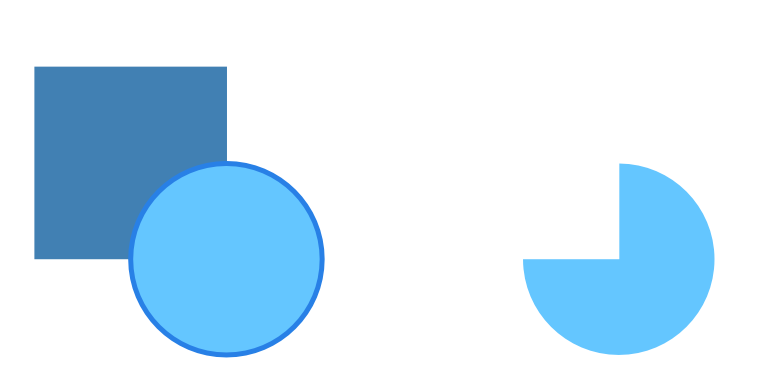
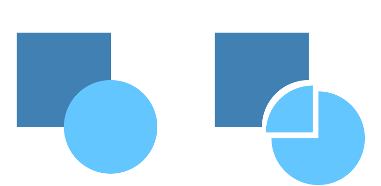
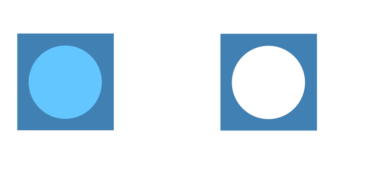
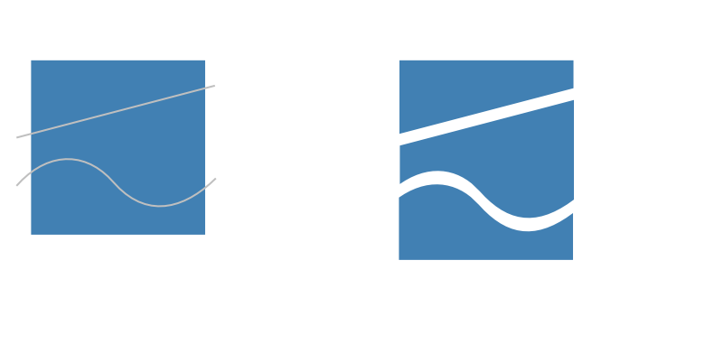

# Joining vector shapes

Vector shapes can be joined together to create composite shape variations which can be fully edited as curves.

## Joining operations

There are various operations available (illustrated as before and after):

**Add**—creates a new curve layer from the sum of the selected shape layers; the color of the lowest object is used.

> **Note:** The **Add** operation can be applied to a single shape, in which case interior overlaps are removed and the resulting shape is the outline of the original shape.

**Subtract**—removes overlapped areas of the lowest object. All other selected objects are discarded.

> **Tip:** Alternatively, with objects selected, press the `Alt`  and click a 'key' object to subtract from, instead of the lowest object. The key object shows with a strong outline colored blue by default or with the containing layer's layer color.
>
> 

**Intersect**—creates a new curve layer from the overlapping areas common to all selected shape layers.

> **Note:** For more than two objects, all objects must intersect each other.

**Xor**—merges selected shape layers into a curve layer with transparent area where filled regions overlap.

**Divide**—splits shape layer areas into separate curve layers; the curve layer from the intersecting area retains the color of the upper shape layer.

*Cut away of a fully overlapping object from the object below (the residual object can be deleted).*

*Object being be split by one or more straight lines or curves.*

> **Note:** By default, the **Divide** operation will trim off any residual straight lines or curves extending beyond the shape’s outline, plus any lines/curves left over between object fragments.
>
> With the `Alt`  pressed during the operation, you can still retain the original curve(s) or line(s) instead (without trimming) but it will be split at every intersecting point.

**To implement join operations:**

1. Select multiple shape layers.
2. **macOS:** Press the `Ctrl`  and click, then from the **Geometry** submenu, select an operations command.
3. **Windows:** Press the right mouse button, then from the **Geometry** submenu, select an operations command.

> **Tip:** Holding down the `Alt`  when selecting **Add**, **Subtract**, **Intersect** or **Xor** will [create a non-destructive compound](../06-layers/13-compound-layer-masks/01-compound.md).

#### SEE ALSO:

- [Draw and edit shapes](07-draw-and-edit-shapes.md)
- [Creating compounds](../06-layers/13-compound-layer-masks/01-compound.md)
