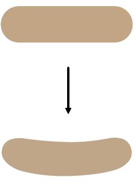

# Converting to curves

You can create new shapes by converting geometric shapes (created using the shape tools) into curves and then adjusting the nodes of the resulting shape.

*The rounded rectangle shape is converted to curves to allow the horizontal edges to be modified.*

The Convert to Curves operation is not limited to geometric shapes. You can also convert text to curves.

*Text converted to curves.*

> **Warning:** Once a shape or text has been converted to curves, it can no longer be edited in its conventional way. For example, you would not be able to change the font of text once it has been converted to curves.

**To convert a shape to curves:**

1. Select the shape with either the **Move** or the **Node Tool**.
2. Do one of the following:
  - Click **Convert to Curves** on the context toolbar.
  - From the **Layer** menu, select **Convert to Curves**.

The shape is now made from curves. Segments and nodes can be modified by double-clicking with the **Node Tool**.

#### SEE ALSO:

- [Draw and edit shapes](07-draw-and-edit-shapes.md)
- [Edit vector lines and shapes](03-edit-vector-lines-and-shapes.md)
- [Joining](11-joining-shapes.md)
