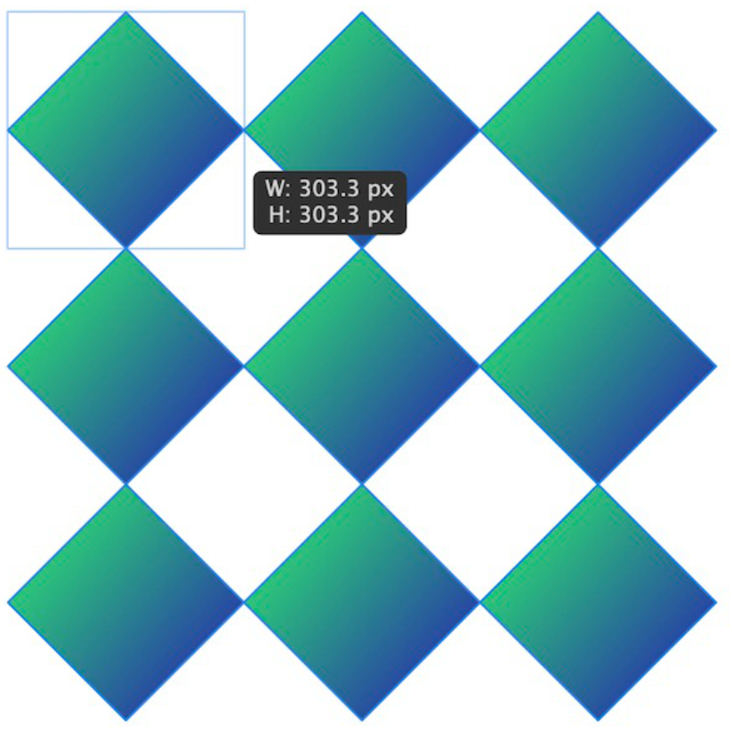

# Quick Grids

While drawing a shape or text frame, you can tell Affinity to repeat the object in a grid and control the spacing between the grid's columns and rows.

For example, you might want to draw:

- a repeating geometric pattern.
- several star shapes in a row.

*A repeating geometric pattern drawn using the Diamond Tool.*

Each object is created on a separate layer. Their order from top to bottom on the layer stack corresponds to columns from left to right and rows from top to bottom.

Each object can be transformed and styled independently or together in a multiple selection.

> **Tip:** After drawing a grid, you can use [power duplicate](../07-layer-operations/05-duplicating.md) to add more columns and rows at a later time.

**To draw a grid of repeated objects:**

1. Using a shape tool, picture frame tool, or the Frame Text Tool, begin drawing an object on a page.
2. Press the right/left arrow key to add/remove columns of the object, respectively.
3. Press the down/up arrow key to add/remove rows of the object to the grid, respectively.
4. (Optional) Hold the right or down arrow key to increase the spacing between columns or rows, respectively. (Conversely, use the left and up arrow keys to decrease spacing.)
5. (Optional) Hold the   and press the right and down arrow keys to adjust the spacing between columns or rows, respectively, by 10x the usual increment. (Conversely, press the left and up arrow keys to decrease spacing by the same amount.)
6. Release to finish drawing the object and the grid.

> **Note:** The change in spacing when performing steps 4 and 5 is determined by the values of **Nudge Distance** and **Modifier Nudge Distance**, respectively, in **Tools** settings.

#### SEE ALSO:

- [Transforming objects](../05-sizing-cropping-and-warping/05-transforming.md)
- [Duplicating objects](../07-layer-operations/05-duplicating.md)
- [Aligning objects](../07-layer-operations/06-aligning.md)
- [Grouping objects](../07-layer-operations/10-grouping.md)
- [Styles](13-styles.md)
