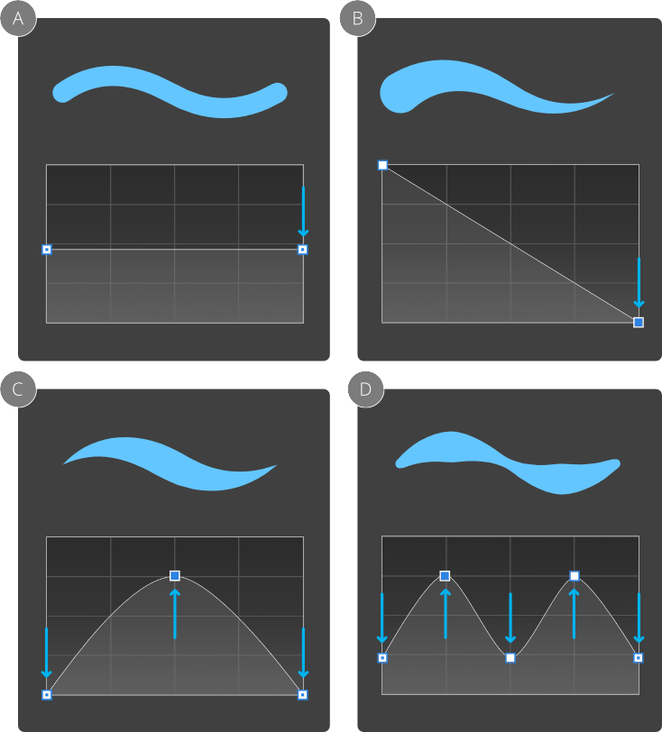

# Pressure sensitivity

**macOS:**

Affinity desktop apps offers complete flexibility when using pen tablets or Force Touch-enabled devices for real pressure-sensitive drawing and painting. If you prefer a mouse or trackpad (not Force Touch), Affinity apps offers simulated pressure sensitivity.

**Windows:**

Affinity desktop apps offer complete flexibility when using pen tablets for real pressure-sensitive drawing and painting. If you prefer a mouse, Affinity apps offers simulated pressure sensitivity.

Whether you're using Pen, Paint Brush tools, or retouch tools, you can simply connect your device and you're ready to go.

For mouse users, Affinity apps let your mouse become velocity sensitive by default. The same brush tools can be used but with simulated pressure sensitivity based on the speed (velocity) of your mouse movements.

This automatic response is governed by the brush controller which is set to automatic by default—it senses the type of input device and varies brush size, flow, etc. as you paint according to a particular input: 'Pressure', 'Velocity', 'Brush Defaults', or 'None'. If set to 'None', the brush is always a fixed size, flow setting, etc. Otherwise, the brush stroke properties will vary from a minimum to maximum amount (e.g. the full brush width).

While you get the response you need from either input, you'll still be able to fine-tune brush settings for pressure/velocity.

- For brush settings: jitter options let you control how brush size and flow are affected by your pressure-sensitive device or mouse. They also affect brush hardness, shape, color, and the scatter and rotation of nozzles.

If you want to create a custom pressure profile that can be applied to a previously drawn stroke, you can design it and apply it from the **Pen Tool**'s context toolbar. This can be optionally saved as is, or modified before saving.

**To create a pressure profile:**

1. On the **Tools** panel, select the **Pen Tool**.
2. On the context toolbar, click **Stroke Properties**, then click **Pressure**.
3. Manipulate the graph to form the desired pressure profile. (See examples below.)
4. Begin drawing your strokes.

*Uniformly reducing stroke width using locked nodes (A), linear tapering of stroke (B; unlocked by `Alt`-drag or second click then drag), tapering of stroke at both ends (C; a combination of A and adding a new node by clicking) and modulating stroke width (D; a combination of A and adding multiple nodes).*

| Node type | Description |
| --- | --- |
|  | End node (deselected)—drag to move *both* end nodes up/down at the same time |
|  | End node (selected)—drag to move *both* end nodes up or down at the same time or click to move the end node independently of the other end node |
|  | Added node (deselected)— drag to reposition the node which becomes selected |
|  | Added node (selected)—drag to reposition the already selected node |

**To save a pressure profile:**

- Under the chart, click **Save Profile**. The profile shows under the chart.

**To apply a custom pressure profile to a selected stroke:**

1. On the **Pen Tool**'s context toolbar, click **Stroke Properties**, then click **Pressure**.
2. Select a custom profile from below the chart. The chart will update, showing the chosen profile.

**To reset the pressure profile:**

- Select **Reset** below the chart.

The profile reverts to its default.

> **Note:** Click on any node to select it. Any added nodes can be deleted by pressing `Delete`.

#### SEE ALSO:

- [Painting brush strokes](../23-painting-and-erasing/01-painting-brush-strokes.md)
- [Draw lines and shapes](02-draw-lines-and-shapes.md)
