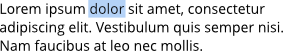
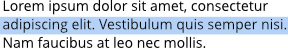
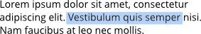
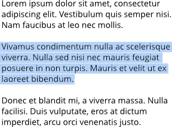
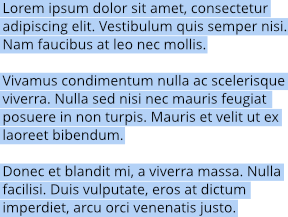

# Working with text

There are several varieties of text—Artistic, Frame and Shape, to give you flexibility when working with typography.

Text objects contain both character and paragraph elements, making it easy to modify standard text attributes such as font, size, format, and alignment. Both text tools have quick access settings on the context toolbar and supporting panels and dialogs for more extensive, advanced options.

When [snapping](../30-design-aids/11-snapping.md) is switched on, the baseline of the first line in a text object will snap to the baseline of the first line in other text objects.

When performing text editing, Photo supports all standard text selection and formatting techniques and shortcuts.

Affinity Photo 2 lets you temporarily hide text while you're concentrating your design work on other areas of your page.

> **Note:** The unique features of artistic text and frame text are discussed in the [Artistic text](03-artistic-text.md), [Frame text](04-frame-text.md) and [Shape text](05-shape-text.md) topics.

> **Note:** If you're opening Affinity documents or vector images (containing text) from another computer, the original fonts used may be missing from your computer. If so, you'll get a **Document Contains Missing Fonts** alert. The font will be substituted for a replacement system font at this time.
>
> When text using the missing font is selected in your document, its font name will be prefixed with a '?' on the context toolbar and on the **Character** panel.
>
> **macOS:**
>
> When opening a document which uses a *downloadable* font (not installed locally in macOS by default), you'll get a prompt to download it—simply click **Download** to install to macOS. Affinity Publisher will then use the installed font as it would with any other font.

> **Tip:** By default, the size of text is expressed in points, regardless of the units set within your document. If you wish text size to reflect document units, this can set in [Settings (or Preferences)](../37-settings-preferences/01-settings-preferences.md) .

**To select text objects for formatting:**

- With the **Move Tool** selected, do one of the following:
  - Click a text object to make formatting changes to all the text within the text object.
  - Double-click a text object to make formatting changes to sections of text within the text object.
- With either of the text tools selected, click a text object to make formatting changes to sections of text within the text object.

**To select text on the page:**

Do one of the following:

| To select... | Action | Example |
| --- | --- | --- |
| a single word | double-click |  |
| multiple words | double-click with the `Cmd`  pressed |  |
| a line | triple-click |  |
| a text range | drag with cursor. Use Shift key to select text between two insertion points. |  |
| a paragraph | quadruple-click |  |
| all paragraphs | quintuple-click |  |

**To move text:**

- With a single word, paragraph, or portion of text selected, drag and drop it where you would like to place it.

**To hide/show all text:**

- From the **Text** menu, select **Hide All Text**. To display again, select **Show All Text**.

> **Preferences — Settings (or Preferences):** Related behaviors can be adjusted from [the app's settings](../37-settings-preferences/01-settings-preferences.md):
>
> - **Miscellaneous>Reset Fonts**
> - **User Interface>Show Text in points**
> - **User Interface>Always use white background for Font dropdown**

#### SEE ALSO:

- [Artistic text](03-artistic-text.md)
- [Frame text](04-frame-text.md)
- [Importing text](02-importing-text.md)
- [Shape text](05-shape-text.md)
- [Character formatting](07-character-formatting.md)
- [Paragraph formatting](08-paragraph-formatting.md)
- [Style Picker Tool](../32-tools/01-photo-editing-tools/04-style-picker-tool.md)
- [Artistic Text Tool](../32-tools/09-text-tools/01-artistic-text-tool.md)
- [Frame Text Tool](../32-tools/09-text-tools/02-frame-text-tool.md)
- [Glyph Browser panel](../33-panels/09-glyph-browser-panel.md)
- [Keyboard shortcuts for working with text](../36-keyboard-shortcuts/01-keyboard-shortcuts.md)
