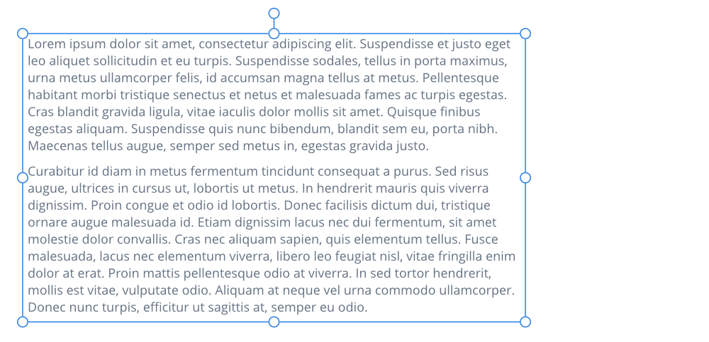
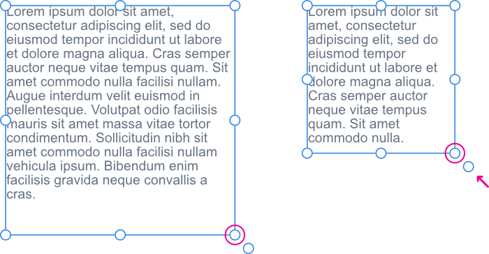
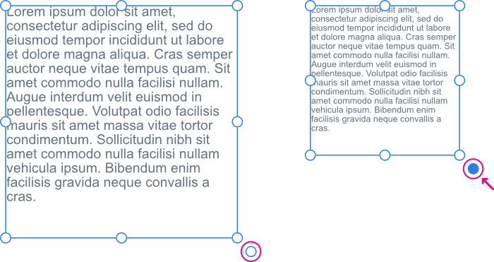

# Frame text

Frame text is perfect for presenting paragraphs with a formalized structure and layout. If you want to present text in columns, frame text is the ideal solution.

By clicking in the drawn frame then typing, you're able to fill the frame with frame text. If excess text overflows the bottom of the frame, you can either reduce the text's font size from the context toolbar or make the text frame larger; both methods will make the text fit the frame.

Frame text can be created within rectangular (square) frames using the **Frame Text Tool** or within any curve or closed shape.

> **Tip:** To achieve natural looking text while working on your design, from the **Text** menu, select **Insert Filler Text**.

**To create frame text:**

With the **Frame Text Tool** selected:

1. Drag on the page. This sets the initial size of the text frame.
2. Do one of the following:
  - Type your text.
  - Paste (`Cmd`V) previously copied text.
  - From the **File** menu, select **Place**. In the pop-up dialog, navigate to and select a file, and click **Open**.

> **Tip:** For text imported from external apps, use **Paste without Format** (**Edit** menu) for 'clean' unformatted text.

> **Tip:** Alternatively, select a previously drawn line, curve or shape and then, from the **Layer** menu, select **Convert to Text Frame**.

> **Note — Modifier keys:** When using the Frame Text Tool, the following modifier keys can be used:
>
> - The `Shift`  constrains frame's proportions at the time of creation (to a square) or when resizing.
> - The `Cmd`  resizes the frame from its center.
> - **macOS:** The `Ctrl`  allows placed frame text to be rotated about its opposite handle.
> - **Windows:** Pressing the right mouse button lets you rotate placed frame text about its opposite handle.

> **Tip — Text Tools and the:** The `Esc`  uses the following logic when a Text Tool is active:
>
> 1. If the `Esc`  is used when glyphs (characters) are selected, the glyphs are deselected but the caret (cursor) remains inside the text object. (You can then continue editing the text within the text object.)
> 2. If the caret is inside the text object and no glyphs are selected, the `Esc`  will remove the caret and select the text object. (You can then press **V** to switch to the Move Tool to reposition the text object.)
> 3. With the text object selected, pressing the `Esc`  will deselect the text object.

## Resizing text frames

When resizing a frame you can control whether:

- Text remains at its set size and reflows through the frame.
- Text scales as the frame is resized.
- Any extra space at the bottom of the frame is to be removed after resize.

> **Note:** Text frames in documents created or modified in Affinity Publisher may be set to display their contents across multiple columns. To set a frame's number of columns to 1 in Affinity Photo 2, select it using the **Move Tool** or the **Frame Text Tool** and click **Remove Columns** on the context toolbar.

**To reflow text:**

With the text frame selected, do one of the following:

- To resize height and width simultaneously, drag the object's corner handles.
- To resize height and width independently, drag the object's side handles.

  

**To scale text:**

- With the text frame selected, drag the object's scale handle (extends from the bottom-right corner of the selection). Any containing frame text will be resized in proportion to the new text frame dimensions.

  

> **Note:** After the text frame is resized, the scale handle will be colored blue to indicate frame text scaling. This is a useful reminder if you've inadvertently scaled text instead of reflowed it.

**To reset scaled frame text back to its original font size:**

- Double-click the blue scale handle.

The text frame will still retain its resized dimensions.

**To fit frame to frame text:**

- Double-click the edge handle at the bottom center of the text frame. If extra space exists between the last line of text and the frame's bottom edge, the space will be removed.

## Aligning text in text frames

Horizontal alignment is a paragraph attribute which can be altered via the Text context toolbar. Vertical alignment of text within a frame is a frame attribute. The latter is good for aligning text centrally with adjacent graphics.

**To vertically align frame text:**

- From the **Text** menu, select an option from the **Vertical Alignment** submenu.

## Using placeholder text

If you're designing before full copy has been written, you can use placeholder (filler) text to help you progress with your project.

**To add filler text:**

- With the text frame selected, from the **Text** select **Insert Filler Text**.

#### SEE ALSO:

- [Working with text](01-working-with-text.md)
- [Importing text](02-importing-text.md)
- [Frame Text Tool](../32-tools/09-text-tools/02-frame-text-tool.md)
- [Artistic text](03-artistic-text.md)
- [Filler text](04-frame-text/01-fillertext.md)
