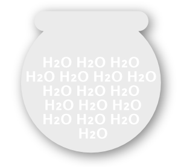

# Shape text

If you want to contain text within a drawn shape, geometric shape or concave area of a curve you can create shape text.

**To create shape text:**

1. Select a previously drawn curve or shape.
2. From the **Tools** panel, select **Frame Text Tool**.
3. Position the cursor over the curve or shape, which will change to indicate shape text will be created.
4. Click for an insertion point, then do one of the following:
  - Type your text.
  - Paste previously copied text.
  - From the **File** menu, select **Place**. In the pop-up dialog, navigate to and select a file, and click **Open**.

#### SEE ALSO:

- [Working with text](01-working-with-text.md)
- [Frame Text Tool](../32-tools/09-text-tools/02-frame-text-tool.md)
- [Filler text](04-frame-text/01-fillertext.md)
