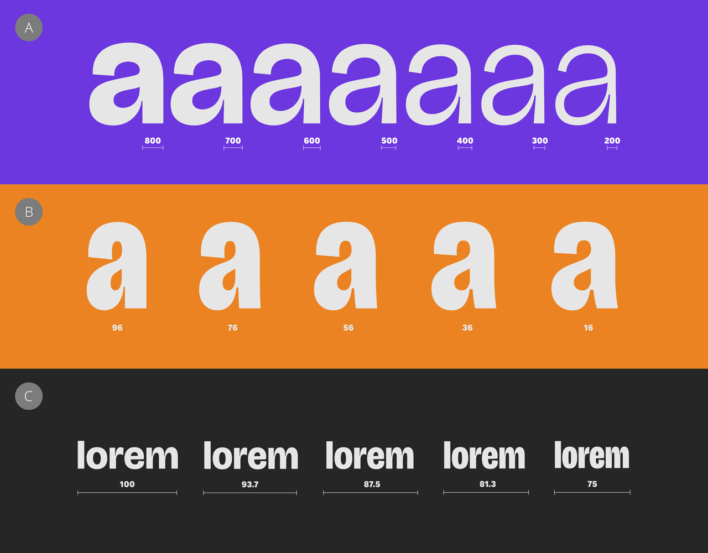
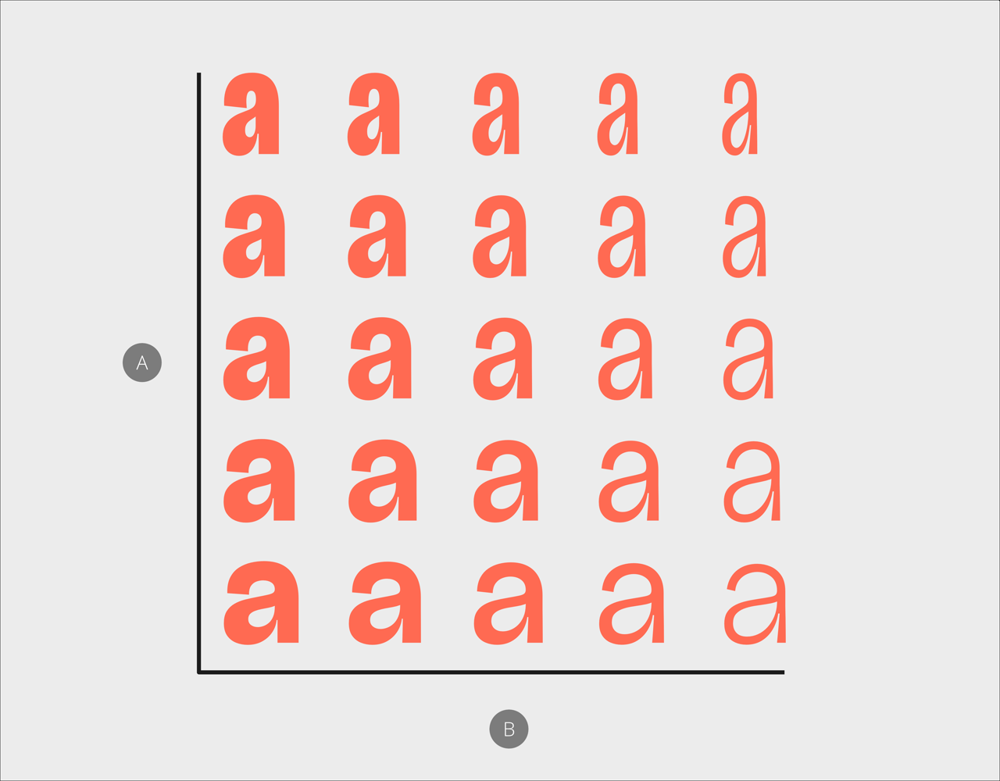

# Variable fonts

When you apply a static font to text, you can often choose from several font styles, such as Regular, Bold and Condensed. Variable fonts,though, allow you to adjust specific aspects of their design, known as axes of variation, or simply axes, along a continuum of values.

*Examples of font variations along common axes: (A) weight (B) optical size (C) width.*

Each axis can be adjusted individually, which allows for many more possible combinations than are available when using static fonts.

> **Note:** Like static fonts, variable fonts include predefined font styles, which are named combinations of values for a font's various axes. When formatting text, they are available via the context toolbar's **Font Style** setting. Elsewhere, you may see them referred to as named instances.

Depending on a font designer's intent, you may be able to make other adjustments to a font's appearance, such as :

- the height of ascenders and descenders, to better fit your chosen line spacing.
- the style of stem terminals, to choose between straight and swollen.
- the width of counters, enclosed and partially enclosed spaces within glyphs, to affect legibility at your chosen font size.

> **Tip:** A large selection of free variable fonts is available from [Google Fonts](https://fonts.google.com/variablefonts).

### Axis availability

You may see fewer axes in Affinity than are mentioned in a font's marketing materials. Affinity respects the OpenType specification's provision for font designers to mark any axis as hidden.

To reveal and modify hidden axes, select **Font Variations** and then select **Show hidden axes**.

> **Warning:** Hidden axes are often used internally by a font and controlled indirectly by your choices for other axes. Amending them directly may result in reduced typographic fidelity.

*A matrix of font variations along the (A) width and (B) weight axes.*

> **Note:** When a document that uses variable fonts is exported to PDF, Affinity creates a static instance of the font with fixed settings for each variation used. Affinity names static instances in a way that should help identify the original variable font when such a PDF is imported or placed in a document.

**To adjust a variable font's settings:**

With text selected that is formatted with a variable font:

1. Do one of the following:
  - On the context toolbar, select **Font Variations**.
  - On the **Character** panel, select **Font Variations**.
2. Adjust the axes' settings as required.

> **Tip:** When adjusting an axis by dragging its slider, holding the `Alt`  overrides snapping to the notches to allow for smaller adjustments.

#### SEE ALSO:

- [Character panel](../33-panels/07-character-panel.md)
- [Working with text](01-working-with-text.md)
