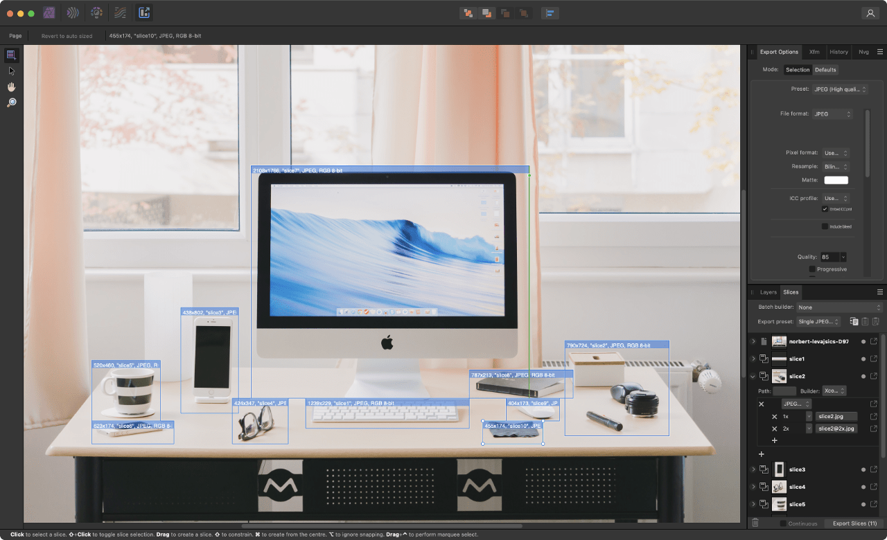
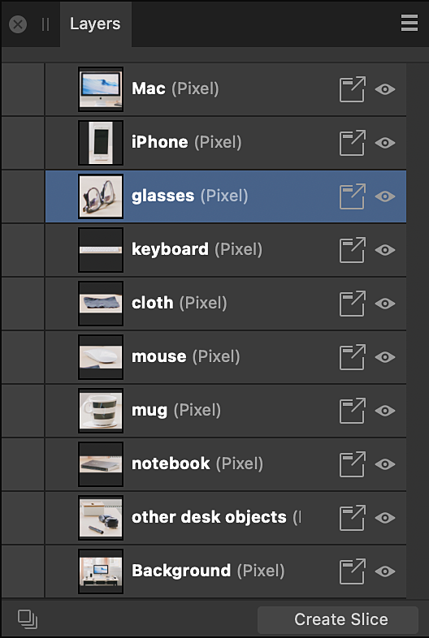
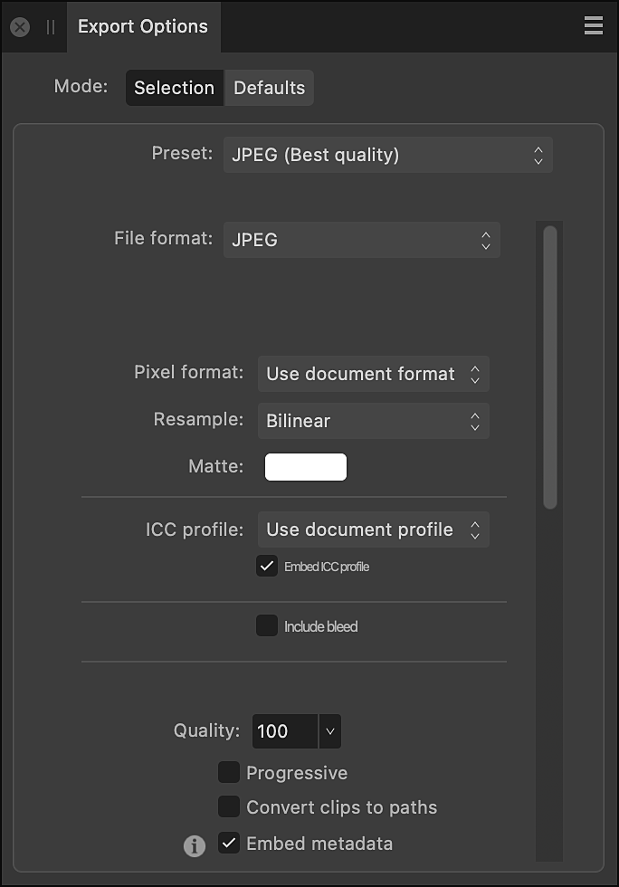
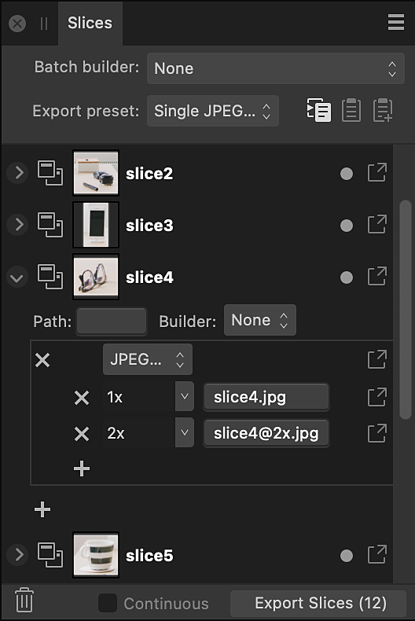

# Exporting using Export Persona

The Export Persona is a dedicated workspace for exporting layers, groups, and objects as export slices to different file formats and image sizes simultaneously. You'll also be able to export custom drawn slices.

*Export Persona with Export Options and Slices panels.*

## How it works

The Export Persona uses a combination of panels and tools to create slices. Slices are export areas which you choose to output from your document.

The Layers panel, Export Options panel and Slices panel are used in combination in Export Persona. The Slice Tool is unique to Export Persona and is used to create custom slices.

## Using the Layers panel

The **Layers** panel in Export Persona is different from the Layers panel in Photo Persona. It is used exclusively as a precursor for selecting layers, groups, or objects from which slices can be created, and added to the **Slices** panel.

*Layers panel in Export Persona.*

When you export a Layers panel item as a slice, the slice will automatically size to what is considered to be the extent of the selected item. At the top of every slice drawn, you will see the exported resolution, name, format and bit depth.

When a slice created via the Layers panel is exported, only content on the layer from which it was created is included in the output.

## Using the Slice Tool

The Slice Tool gives you full freedom to create export areas of all sizes, over any part of your document.

When a slice created with the Slice Tool is exported, content from all visible layers within its area is included in the output.

For more information see [working with slices](01-exporting-using-export-persona/01-exportslices.md).

## Using the Export Options panel

The **Export Options** panel lets you set up your default export settings, or settings for the currently selected item prior to slice creation.

*Export Options panel in Export Persona.*

## Using the Slices panel

The **Slices** panel stores all your slices (from the Layers panel or Slice Tool) ready for export directly from the panel. Each created slice has an initial export format (e.g., PNG, JPEG, or SVG) associated with it on creation, with additional export formats being added per slice if needed; each export format lets you export at different size scaling or absolute sizes.

*Slices panel in Export Persona.*

You can use the filenames in the **Slices** panel to specify (or create) a folder hierarchy in which to place your exported files. This is achieved through the use of the forward slash, or oblique, character.

For example, a PNG hero image could be placed within an **img** folder within an **assets** folder using the following syntax: **assets/img/hero**

If any part of the folder structure does not exist, the folder hierarchy will be created when the appropriate slices are exported using **Export Slices (*n*)**.

> **Tip:** You can export the entire document's page using **File>Export** or by selecting the predefined spread area on the **Slices** panel.

## Exported slice dimensions and DPI

When exporting slices via the Export Persona, the slice export size (1x, 2x, 3x, etc.) is linked with your document's DPI. The table below shows how DPI and export size affect export dimensions, using a 64x64 px document as an example.

| DPI setting for a 64x64 document | Export dimensions (in pixels); Exported DPI |
| --- | --- |
|  | 1x |
| 72 | 64x64; 72 |
| 96 | 64x64; 96 |
| 144 | 32x32; 72 |
| 192 | 32x32; 96 |
| 216 | 21x21; 72 |
| 288 | 21x21; 96 |

#### SEE ALSO:

- [Layers panel (Export Persona)](04-layers-panel.md)
- [Export Options panel](02-export-options-panel.md)
- [Slices panel](03-slices-panel.md)
- [Working with slices](01-exporting-using-export-persona/01-exportslices.md)
- [Export](../27-sharing/01-export.md)
