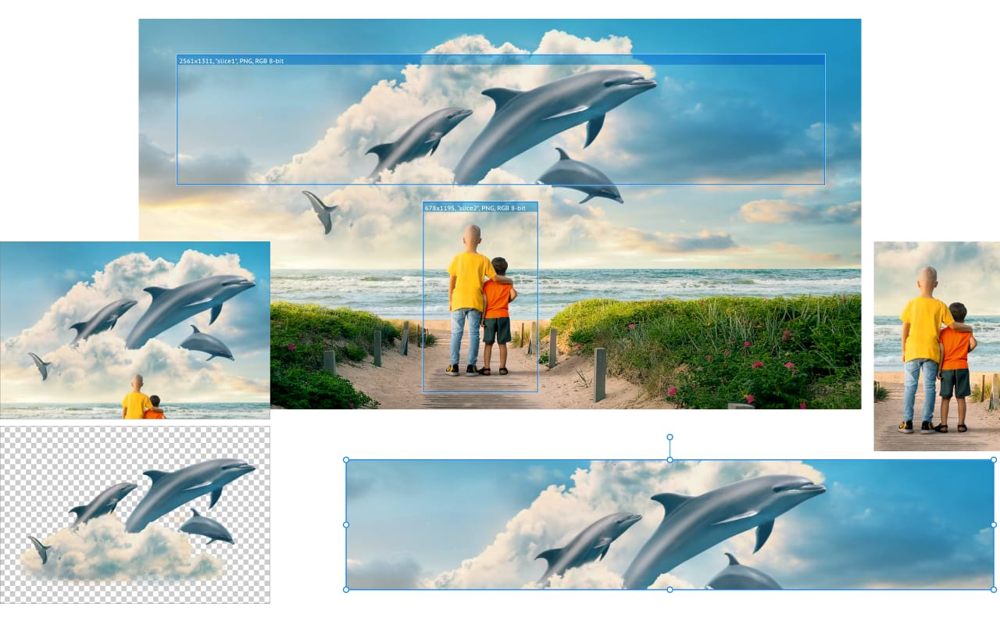

# Working with slices

Create export areas of all sizes from any part of your composition.

**To export objects as slices:**

1. On the **Layers** panel, select a layer, group or object and click **Create Slice**.
2. Do one of the following:
  - On the [Export Options panel](../02-export-options-panel.md), adjust export settings as appropriate.
  - Jump to the [Slices panel](../03-slices-panel.md), expand the slice entry and alter the export format or choose an **Export preset** from the pop-up menu (PNG, JPEG, and Apple icon design presets only).
3. (Optional) On the [Slices panel](../03-slices-panel.md), click the + icon under the export format entry to add an additional graphic export format.
4. (Optional) On the [Slices panel](../03-slices-panel.md), click the indented + icon under the export size entries to add increasing levels of resolution (2x, 3x, etc.) to the export format.
5. Do one of the following, to control what gets exported:
  - Select **Click to export all formats for this item**.
  - Select **Click to export this format**. This exports all sizes specified for the selected slice.
  - Select **Click to export this size**. This exports a specific export format for a slice at a specific size.
  - Click **Export Slices (*n*)** to export all formats and sizes for all checked slices in the Slices panel.
6. Navigate to and select the storage folder for the exported image(s) and then click **Export**.
7. (Optional) On the **Slices** panel, select **Continuous** if you want to automatically re-export export areas if the document is subsequently changed. This option is only available if **Export Slices (*n*)** was selected above.

**To export drawn slices:**

1. Select the **Slice Tool**.
2. Drag on the page to select areas.
3. Repeat step two onward from the procedure above, as required.

**To set default export options:**

1. On the **Export Options** panel, select the **Defaults** tab.
2. Adjust settings as appropriate.
3. Jump back to the **Selection** tab when finished.

The settings will be used when your next slice is created.

**To reset the dimensions of a manually resized export area created from a layer:**

1. With the **Slice Tool**, select a resized export area.
2. On the context toolbar, select **Revert to auto sized**.

> **Note — Modifier keys:** When using the Slice Tool, the following modifier keys can be used:
>
> - The `Shift`  constrains the area's proportions to a square.
> - The `Cmd`  if pressed as you drag out a slice area, draws from the center of the original drag position (can be combined with the `Shift` ).

#### SEE ALSO:

- [Slices panel](../03-slices-panel.md)
- [Export](../../27-sharing/01-export.md)
- [Layers panel (Export Persona)](../04-layers-panel.md)
- [Export Options panel](../02-export-options-panel.md)
- [Export Persona](../01-exporting-using-export-persona.md)
