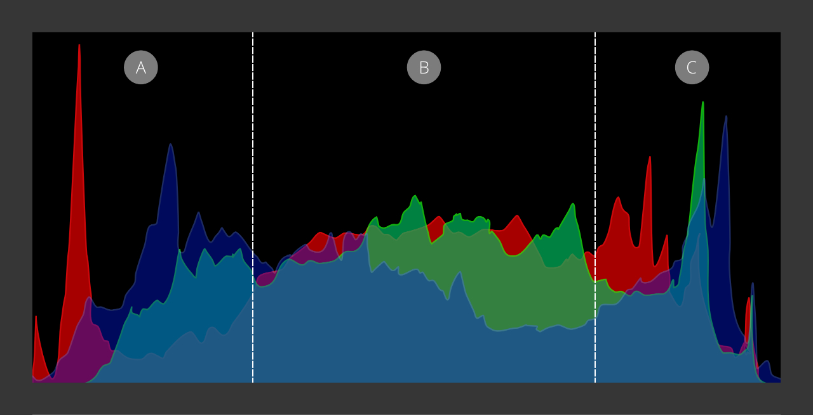
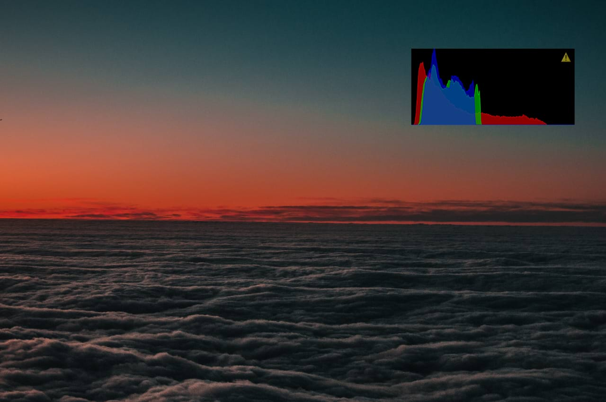

# Using a histogram

A histogram provides a graphical representation of the tonal range in an image. Understanding how to read and interpret a histogram ensures photographers get to the starting point of their edits faster and with fewer errors to fix later in post-production.

A histogram is available as an option to display on most modern digital cameras. In Affinity, it is available as a panel both in the Develop and Photo Persona.

*Histogram panel indicating tonal areas: (A) Shadows, (B) Midtones, (C) Highlights.*

## About a histogram

A histogram is divided into three areas representing the tonal values of an image: the dark tones readout appears on the left, the midtones in the center, and highlights on the right, as pictured above.

> **Note:** The far-left and far-right edges represent pure black and pure white, respectively. You should avoid readouts of the graph peaking at those edges to preserve details in the shadows and highlights.

You may have come across the term "shoot to the right", meaning the correct exposure presented by the graph to take the form of evenly growing values from the shadow areas (left) towards the highlights (right).

Although that may be a great starting point, it isn't always possible. Additionally, the photographer's creative vision might vary from what technically is regarded as correct exposure. Don't be afraid to experiment to arrive at your intended output. For example, try changing your camera's shutter speed, aperture, and ISO settings to achieve the following effects:

- The histogram with the graph pushed to the left for dark and moody photos.
- The histogram with the graph pushed to the right for light and airy photos.

Dark and Moody

Light and airy

## Why use a histogram?

Relying on the histogram readout aids in capturing images in challenging lighting conditions: in bright sunlight or at night, for example, where the camera's built-in LCD screen is likely to give a false representation of a scene's exposure.

> **Tip:** Avoid setting a vivid or other contrasty image profile in-camera when taking your photos, as this may mean a harsh histogram readout.

Preparing your images for printing is another area where you should observe the histogram. Paying attention to the left and right edges of the graph, note the exclamation mark to indicate lost details in either the dark or light tones. When printed, those areas would be pure black or white, respectively, which isn't desirable.

To ensure details are preserved, and the appropriate tonal range is present in your photos, experiment with the [Levels](../10-adjustments/02-tonal-adjustments/04-adjustment-levels.md) and [Curves](../10-adjustments/02-tonal-adjustments/02-adjustment-curves.md) adjustments.

#### SEE ALSO:

- [Scope panel](../33-panels/21-scope-panel.md)
- [Histogram panel](../33-panels/10-histogram-panel.md)
- [Levels adjustment](../10-adjustments/02-tonal-adjustments/04-adjustment-levels.md)
- [Curves adjustment](../10-adjustments/02-tonal-adjustments/02-adjustment-curves.md)
