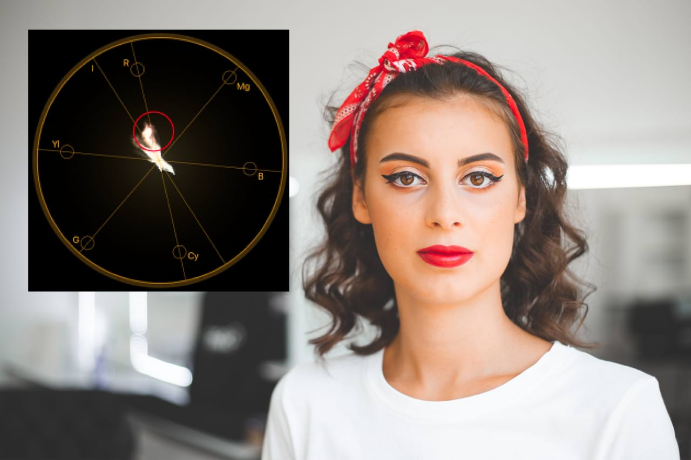
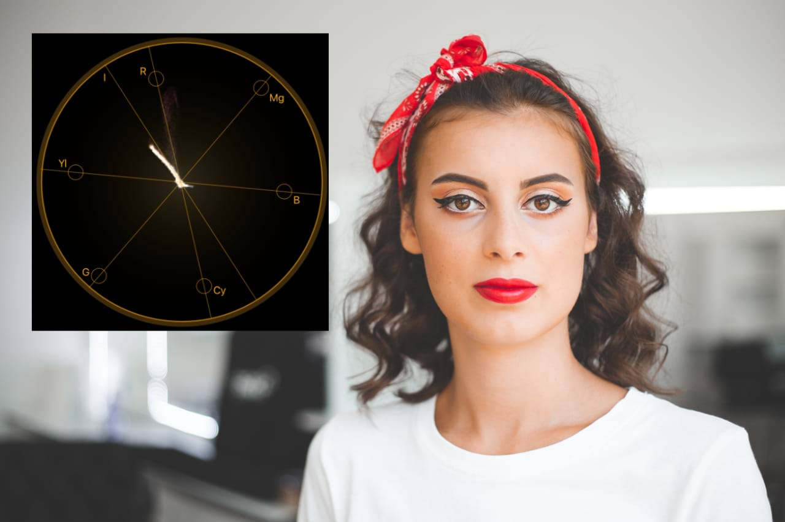

# Using Vectorscope

Available as a chart in the [Scope panel](../33-panels/21-scope-panel.md), **Vectorscope** presents color and saturation data measured via the image signal. Its representation allows for accurate evaluation of color and thus aids workflows where it is challenging to judge the output by eye.

*Before and after skin color correction using Vectorscope as an aid.*

## About Vectorscope

The Vectorscope pie chart is divided into six parts representing the main colors of the RGB color space (red, green, blue) as well as their inverse equivalents (cyan, magenta, yellow). The chart places signal information from the image according to where its value sits in relation to the color space. For example, if there is a significant amount of blue color in the image, its representation will appear in the region of the blue line.

Additionally, the chart includes the *I* line, which may be used as an aid during correcting skin tones; the idea here is to adjust skin colors in such a way that their representation sits along this line.

> **Tip:** To better understand the Vectorscope chart readout, on a new pixel layer, brush in strokes of the main RGB color space colors and observe how they are represented.

**To open the Vectorscope chart:**

1. From the top menu, choose **Window>Scope**.
2. In the panel, change the scope type to **Vectorscope**.

**To use Vectorscope as an aid in skin tone correction:**

1. Using the Crop Tool, crop into an area that is visibly inaccurate in the image, e.g. too saturated. Observe the representation of color on the Vectorscope chart.
2. Undo the cropping action.
3. Open the HSL adjustment and, from the dialog, use the Picker to sample color from the skin area that needs correcting.
4. Modify the Hue Shift slider to add a positive value (i.e. push it right slightly) while balancing the Saturation Shift with a negative value.
5. Observe the Vectorscope chart's *I* line and ensure that the color representation of the adjustment aligns with it.

> **Note:** The most effective outputs are achieved by small increments of adjustments. White Balance and Vibrance can also be used in addition to HSL to further tweak the correction.

> **Tip:** To limit your edits to just the skin area of the subject, and to take things further, use Affinity Photo 2's non-destructive [masking](../06-layers/12-layer-masks.md) and [selecting](../08-selections/01-creating-pixel-selections/01-overview.md) techniques.

#### SEE ALSO:

- [Scope panel](../33-panels/21-scope-panel.md)
- [Histogram panel](../33-panels/10-histogram-panel.md)
- [Layer masks](../06-layers/12-layer-masks.md)
- [Create pixel selections](../08-selections/01-creating-pixel-selections/01-overview.md)
