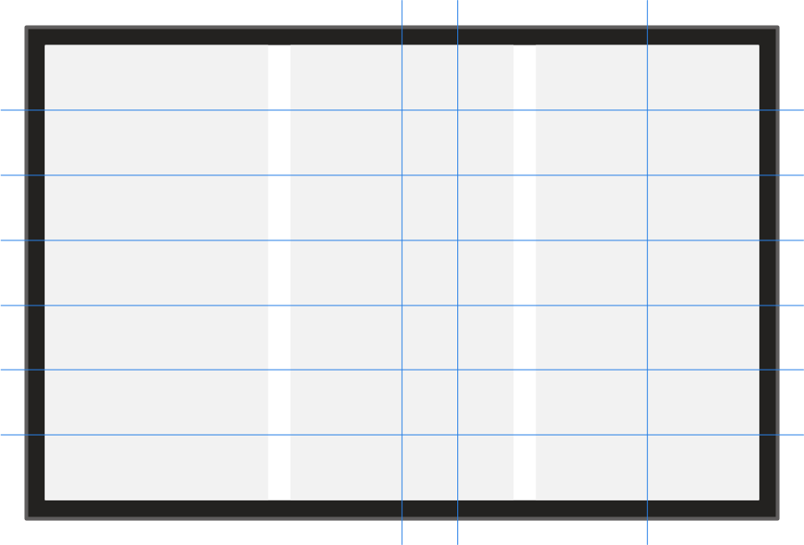

# Ruler and column guides

Guides are non-printing, non-exporting lines that float over page objects and assist with their positioning. There are two types of guides to aid a variety of designs—ruler and column. They can be created and positioned by dragging from a ruler (for 'by eye' placement) or via **View>Guides** (for precision using the document's units or a percentage).

*Vertical and horizontal ruler guides (blue) over a three-column guide layout (gray).*

## Ruler guides

Ruler guides can be set in accordance with the horizontal or vertical ruler, but can be freely moved and positioned on your page.

**To open Guides settings:**

Do one of the following:

- On the **View** menu, select **Guides**.
-  With the **Move Tool** selected, double-click an existing ruler guide in the document view. The guide will become selected.

**To add a ruler guide:**

Do one of the following:

- With the **Move Tool** active, for 'by eye' placement, drag from either the horizontal or vertical [ruler](07-rulers.md) which can be switched on via the **View** menu.
-  On **Guides** settings, click the **Add new guide** icon for either horizontal or vertical ruler guides.

> **Note:** Use the up/down arrow keys or the mouse wheel (if available) to nudge guide values.

**To clone a ruler guide:**

- With the **Move Tool** active, drag a guide with the `Cmd`  pressed.

**To move a placed ruler guide:**

Do one of the following:

- Drag the guide with the **Move Tool** when you see the cursor change.
- With any tool, ensure that **Show Rulers** is switched on (via the **View** menu) and drag the guide marker directly from the horizontal or vertical ruler to reposition the guide.
- From the **View** menu, select **Guides**. Double-click on the value for the guide you want to edit and type a new position into the value field, use your keyboard's up/down keys or mouse scroll wheel.

> **Tip:** For both cloning and moving guides, a readout reports the distance from the spread origin (X or Y) and original guide position (Δ delta).
>
> With **Snapping** enabled on the Toolbar, you can snap back to the cloned or 'moving' guide's original position. This is useful for rechecking the drag distance (delta) before cloning/repositioning the guide.

> **Tip:** Guide positions will automatically update relative to a repositioned [spread origin](07-rulers.md).

**To position ruler guides by percentage:**

1. From the **View** menu, select **Guides**.
2. Select the **Percent** option.

Percentages are calculated from the top-left of the document page.

**To reposition the spread origin:**

- Do one of the following:
  - Drag the spread origin from the ruler intersection to position it on the page. If snapping has been activated, the spread origin will be able to snap to objects on the page.
  - From the **View** menu, access **Guides**. Enter **X** and **Y** values into the **Spread Origin** section.

**To show or hide ruler guides:**

- From the **View** menu, select **Show Guides**. A check mark is displayed next to the menu item when the guides are visible.

> **Note:** If guides are hidden, they will automatically become viewable again if a new guide is added by dragging from a ruler.

**To remove ruler guides:**

Do one of the following:

- With the **Move Tool** selected, drag the guide off the page.
- With the `Alt`  pressed, click on a guide.
-  From the **View** menu, select **Guides**. Click to select the value for the guide you want to delete and then click the **Remove guide** icon.

> **Tip:** When creating or moving objects, you can snap to guides.

**To lock all guides:**

- From the **View** menu, select **Lock Guides**.

## Column guides

Column guides allow you to specify a number of evenly spaced columns and rows and are perfect for designing layouts such as web mockups.

**To add a column guide:**

- From the **View** menu, switch on **Show Column Guides** then select **Guides**. The **Column Guides** section allows you to manage the following:
  - **Columns**—defines the number of vertical guides that will appear.
  - **Rows**—defines the number of horizontal guides that will appear.
  - **Gutter**—defines the size of the gutter.
  - **Style**—select from **Filled** or **Outline**.

**To change ruler or column guide color:**

1. From the top menu, select **View>Guides**.
2. On the pop-up dialog, click **Set the column guide color** and set the new color.

**To show or hide column guides:**

- From the **View** menu, select **Show Column Guides**. A check mark is displayed next to the menu item when the guides are visible.

**To remove column guides:**

- From the **View** menu, select **Guides**. Reduce the number of **Columns** and **Rows** in the **Column Guides** section to 1.

> **Note — Modifier keys:** The following modifier keys can be used:
>
> - The `Cmd`  clones a dragged ruler guide.
> - The `Alt`  deletes a clicked ruler guide.
> - The `Shift`  snaps a 'moving' guide to ruler units based on the spread origin.
> - The `Shift` and `Alt` s snap a 'moving' guide to the drag distance (delta) based on ruler units.

#### SEE ALSO:

- [Snapping](11-snapping.md)
- [Dynamic guides](09-dynamic-guides.md)
- [Rulers](07-rulers.md)
- [Margins](06-margins.md)
