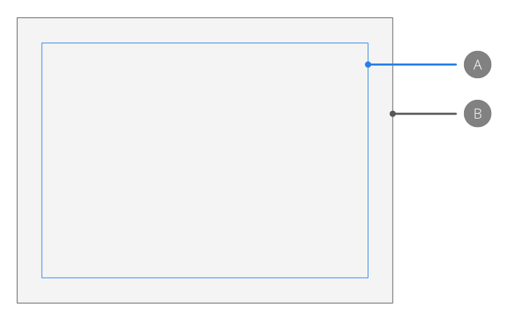

# Margins

Page margins allow you to design with printing in mind. Margins (hidden by default) are indicated by a blue solid line, but this color can be changed.

*Default margin (A) in relation to page edge (B).*

The margins give an indication of the extent of the page that will be printed when using a desktop printer. Design elements positioned outside the margins may not be printed.

Margin positions are set up on document creation either manually or by using the settings of an installed printer. They are non-printing and non-exporting.

> **Note:** Margins can also be used for snapping to when creating or moving layer content.

**To set page margins:**

1. On document setup, check **Include margins**.
2. In the dialog, do one of the following:
  - Set the **Left Margin**, **Right Margin**, **Top Margin**, and **Bottom Margin**.
  - Click **Retrieve Margin from Printer** to automatically set margins to the settings of your desktop printer.

> **Tip:** If you intend to export your design, rather than printing it directly, you can design without added margins. If this is the case, you can keep the **Include Margins** unchecked on document setup.

**To edit the current document's margins:**

- From the **Document** menu, select **Margins**.

**To hide/show margins:**

- From the **View** menu, deselect/select **Show Margins**. A check mark is displayed next to the menu item when the margins are visible.

#### SEE ALSO:

- [Snapping](11-snapping.md)
- [Guides](05-ruler-and-column-guides.md)
