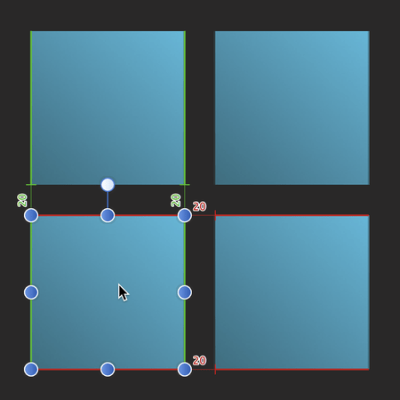
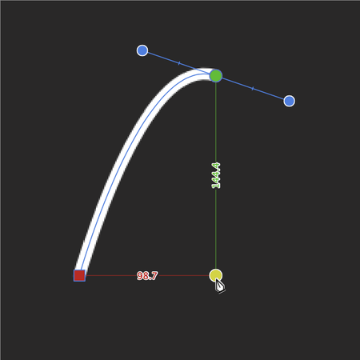

# Dynamic guides

Dynamic guides are intelligent guide lines which automatically appear when moving and aligning vector shapes or a curve's nodes.

Dynamic guides appear automatically in two instances:

- As you drag vector layer content to help you align and resize to a shape's, line's or text's edges, centers, vertices, and page elements (e.g. page margins). These guides display in red when aligning horizontally and in green when aligning vertically.  
You'll only see them when snapping is enabled, and when your snapping preset has the **Snap to object bounding boxes** option checked.

  
- When drawing curves with the Pen Tool. If **Snap** options on the tool's context toolbar are enabled, nodes or control handles can be snapped to other nodes. To help this, dynamic guides show while dragging nodes or handles. Snapping and guide behavior is completely independent of the 'global' Snapping option on the main toolbar.  
  

#### SEE ALSO:

- [Snapping](11-snapping.md)
- [Pen Tool](../32-tools/02-vector-line-tools/01-pen-tool.md)
- [Draw and edit geometric shapes](../25-lines-and-shapes/07-draw-and-edit-shapes.md)
- [Guides](05-ruler-and-column-guides.md)
