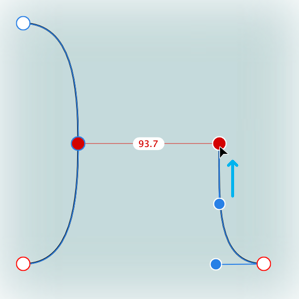
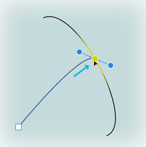
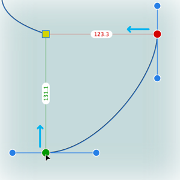
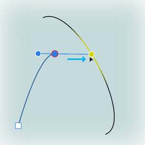
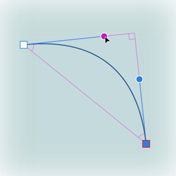
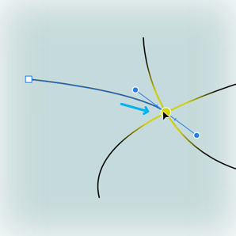

# Curve snapping

Curve snapping lets you align any moving node (or control handle) to an already placed node or curves's geometry.

You can take advantage of curve snapping either as you draw with the Pen Tool or when editing the curve with the Node Tool. Curve snapping gives you accurate positional control of nodes where a more symmetrical approach to curve drawing is needed.

> **Note:** Curve snapping operates independently of global snapping but can be used conjunction with it.

The curve snapping options are hosted on the Pen or Node Tool's context toolbar. Snapping options can be used in combination with each other.

| Snap option | Description | Example |
| --- | --- | --- |
|  Align to nodes of selected curves | aligns moving node horizontally (shows in red) or vertically (in green; not shown) to another node |  |
|  Snap to geometry of selected curves | Snaps moving node to the same or different curve's path (shown in yellow) or node |  |
|  Snap all selected nodes when dragging | Snaps multiple selected nodes (shows in red and green), when dragging, to a 'target' node (yellow) on any selected curves |  |
|  Align handle positions using snapping options | Snaps control handle to curve's path (shown in yellow) or nodes (if global Snap to object geometry is enabled), or to grid or guides if Snap to grid or Snap to guides is enabled |  |
|  Perform construction snapping | snaps control handles to suggested angles and alignments for precise geometry and positioning. See separate [Construction snapping](13-construction-snapping-for-curves.md) topic. |  |

> **Note:** When drawing, you can also snap the moving node to any curve intersection point if the global snapping option **Snap to object geometry** is enabled.  
>  

**To switch on curve snapping options:**

1. Select the **Pen Tool** or **Node Tool**.
2. From the context toolbar's **Snap** section, enable combinations of the buttons for different curve snapping behavior.

#### SEE ALSO:

- [Snapping](11-snapping.md)
- [Construction snapping](13-construction-snapping-for-curves.md)
