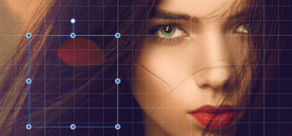

# Grids

A non-printing, non-exporting grid can be displayed on your page to help you lay out layer content more accurately.

*Pixel grid showing at a higher magnification level.*

Grids can be automatic or fixed—the former (as default) changes the frequency of grid subdivisions as you zoom in/zoom out, the latter always keeps the grid frequency constant (irrespective of zoom level).

Both grids are overlaid over your page and work best when combined with snapping, in particular when the Snap to Grid option is enabled. They will line up perfectly with [rulers](07-rulers.md) (when switched on) and, to alleviate poor contrast in some designs, can have a different color from the default gray color.

**To show or hide the automatic grid:**

- On the **View** menu, select **Show Grid**.

**To adjust automatic grid spacing:**

With the **Zoom Tool** selected, do one of the following:

- Zoom in to see smaller grid divisions.
- Zoom out to see larger grid divisions.

At all zoom levels the grid shows as grid 'blocks' further split into grid subdivisions.

**To create a fixed square grid:**

1. From the **View** menu, select **Grid and Axis**.
2. Select **Basic** mode.
3. Set the **Spacing** and **Divisions** values.
4. Click **Close**.

**To show or hide the fixed square grid:**

- On the **View** menu, select **Show Grid**.

**To customize grid color/opacity:**

1. From the **View** menu, select **Grid and Axis**.
2. Click the **Grid lines** or **Subdivision lines** swatch to display a pop-up panel to set the line color(s).
3. Drag the sliders to set the opacity of either, or both, line colors.
4. Click **Close**.

> **Note:** For a different color or opacity for the subdivision lines compared to the main grid lines, click the **Link the grid colors** symbol next to the swatches.

**To create a rectangular grid:**

1. From the **View** menu, select **Grid and Axis**.
2. Select **Advanced** and uncheck **Uniform**.
3. Do one of the following:
  - Set the **Spacing** and **Divisions** for the first and second axis.
  - Select **Fixed aspect ratio**, set the **Spacing** and **Divisions** for the first axis and then set the **Aspect ratio** and **Divisions** for the second axis.
4. Click **Close**.

**To create a fixed angular grid:**

1. From the **View** menu, select **Grid and Axis**.
2. Select **Advanced**.
3. From the **Grid type** pop-up menu, select **Two axis custom**.
4. Set the **Angle** of either axis.
5. Click **Close**.

## Presets

To make grid setup quick and easy, one of several grid presets can be chosen depending on how you plan to work.

**To select a preset:**

1. From the **View** menu, select **Grid and Axis**.
2. From the **Preset** pop-up menu, select a preset.

> **Note:** Available grid presets will vary depending on the type of document units used. To use different grid presets, you will have to change document units.

**To customize a preset:**

1. From the **View** menu, select **Grid and Axis**.
2. Select a preset on which to base your new grid options.
3. Check individual options on/off to override the current preset's options.

The options will be in effect immediately.

**To save as a custom preset for future use:**

1. Click the **Options** menu adjacent to the **Preset** pop-up menu..
2. Select **Create preset**.

The custom preset is in effect immediately.

**To manage grid presets:**

1. On the **Grid and Axis** dialog, choose a preset or create your own.
2.  Click **Panel Preferences**.
3. Select **Set as Default** or **Clear Default**, as required.

## About pixel grid

When working with images at large magnification levels, zooming in an undetermined amount, a pixel grid serves as a handy visual aid. Pixel art, detail retouching and working with selections are just some examples of its use. A different grid color can also aid work where there is little color variance in the image.

> **Note:**   Enabling **Snap to grid** option will not initiate snapping to the pixel grid. However, you can snap to it by turning **Force Pixel Alignment** on and **Move by Whole Pixels** off.

**To create a pixel grid:**

1. From the **View** menu, do one of the following:
  - Select **Show Pixel Grid**.
  - Select **Grid and Axis**. In the dialog, check **Show pixel grid**.
2. Optionally, for the latter option, modify **Pixel grid lines** color for better grid visibility.

> **Note:**  Enable **Force Pixel Alignment** to ensure you are snapping to the pixel grid while working.

#### SEE ALSO:

- [Snapping](11-snapping.md)
- [Pixel-aligned painting](../23-painting-and-erasing/03-pixel-aligned-painting.md)
- [Isometric and axonometric grids](16-isometric-and-axonometric-grids.md)
- [Zooming](../03-get-started/08-zooming.md)
- [Zoom Tool](../32-tools/01-photo-editing-tools/07-zoom-tool.md)
- [Pixel Tool](../32-tools/05-paint-tools/03-pixel-tool.md)
- [Document units](../03-get-started/06-document-units.md)
