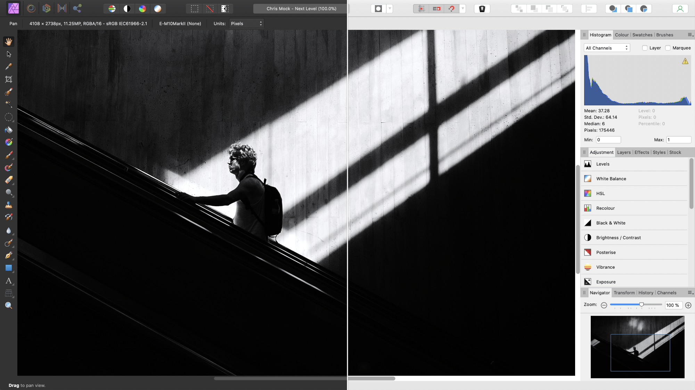
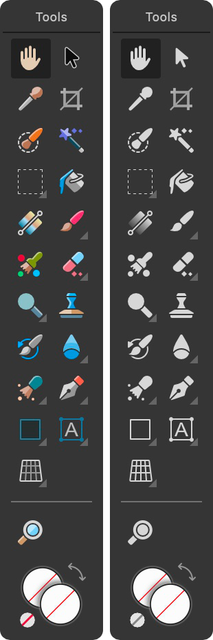

# Changing the UI appearance

Affinity Photo 2 has a dark User Interface (UI) by default. This makes it easier to accurately view and edit the colors in your document. However, you can swap the UI from dark to light (and vice versa), adjust the background grayscale or the overall gamma for contrast changes, and switch from colorized to monochromatic iconography in the UI.

*Dark vs light UI styles.*

*Colorized (default) vs monochromatic iconography.*

**To change the UI from dark to light (or vice versa):**

1. **macOS:** Choose **Affinity Photo 2**>**Settings** (or >**Preferences**).
2. **Windows:** Choose **Edit**>**Settings** (or >**Preferences**).
3. Click the **User Interface** label.
4. For **UI Style**, choose either Dark or Light.

**To change the UI background, Artboard background or Gamma level:**

1. **macOS:** Choose **Affinity Photo 2**>**Settings** (or >**Preferences**).
2. **Windows:** Choose **Edit**>**Settings** (or >**Preferences**).
3. Click the **User Interface** label.
4. Drag the sliders to set the **Background Gray level**, **Artboard Background Gray level** and/or **UI Gamma** level.

**To display monochromatic icons in the UI:**

1. **macOS:** Choose **Affinity Photo 2>Settings** (or **>Preferences**).
2. **Windows:** Choose **Edit>Settings**.
3. Click the **User Interface** label.
4. For **Icon Style**, choose Mono.

#### SEE ALSO:

- [App and document windows](01-application-and-document-windows.md)
- [Customizing the workspace](04-customize/02-workspace.md)
- [Customizing the Toolbar](04-customize/04-toolbar.md)
