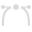
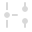
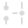
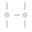
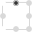
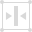
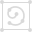

# Node Tool

The **Node Tool** is used to edit existing lines and shapes.

### Settings

The following settings can be adjusted from the context toolbar:

- **Fill**—click the color swatch to display a pop-up panel to update fill color.
- **Stroke**—click the color swatch to display a pop-up panel to update stroke color.
- **Stroke properties**—click to access stroke properties such as stroke style, width, cap, join and align, as well as arrowhead styles and manual pressure profiles.
-    **Convert**—converts the selected node into a **Sharp**, **Smooth**, or **Smart node**.
- **Action**—Manipulates the curve(s):
  -  **Split Curve After Node** adds a new node at the midpoint of one of the curve segments of the currently selected node, depending on the current curve orientation (indicated by a red-line indicator). Use **Reverse Curve** to change this curve orientation.
  -  **Break Curve** opens the shape at the selected node.
  -  **Close Curve** joins the start and end nodes to create an enclosed shape.
  -  **Smooth Curve** modifies a line or shape, by adding and removing nodes, to create a rounder and softer curve effect.
  -  **Join Curves** connects two separate curves together to make one curve. Curves need to be both selected with the `Shift`  using either the Node Tool or `Cmd`  as you draw.
  -  **Reverse Curve** reverses the direction the curve was drawn in.
- **Transform**—Transforms the selected node(s):
  -  **Transform Mode**—when selected, creates a bounding box around the selected nodes, allowing them to be transformed as a group.
  -  **Enable Transform Origin**—displays a movable transform origin about which the selection box can be rotated.
  -  **Hide Selection while Dragging**—when selected, the selection box is temporarily hidden when transforming. If this option is off, the selection box remains visible during transformation. The selected behavior persists across all objects unless it is manually switched.
  -  **Show Alignment Handles**—when selected, displays alignment handles at the center and edges of the selected object. Hovering over these handles displays a floating guideline across the page. You can drag the handles to position the center or edges of the selected object in line with this guide.
  -  **Transform Objects Separately**—when selected, where multiple objects are selected, they can be be resized, rotated and sheared independently of each other instead of transforming the bounding box.
  -  **Selection Box From Curves**—when selected, the selection box encompasses and includes all curves that extend outside the array of currently selected nodes.
- **Snap**—Controls node snapping: These options are independent of the global [snapping](../../30-design-aids/11-snapping.md) options.
  -  **Align to nodes of selected curves**—aligns any moving node you drag to any other node on the same or a different curve.
  -  **Snap to geometry of selected curves**—will snap moving node to the same or different curve's path or node.
  -  **Snap all selected nodes when dragging**—will snap multiple selected nodes, when dragging, to a "target" node on any selected curves.
  -  **Align handle positions using snapping options**—will snap a control handle using any of the snapping criteria currently set in Global snapping, e.g. to grid, guide, object geometry, key points, spread, margin, etc.
  -  **Perform construction snapping**—allows control handle snapping:
    - inline with adjacent node.
    - to 90° from inline.
    - to reflected angle with adjacent control handle.
    - parallel to adjacent control handle.
    - 90° to parallel control handle.
    - to logical triangle.
- **View**:
  -  **Show Orientation**—displays the segment leading up to the end node in red to help visualize the direction of the closed shape's outline (used for winding fill mode); the drawing direction is away from the red-line indicator.

> **Note:** If a geometric shape is selected rather than a curve, the Node Tool's context toolbar will show options applicable to a selected geometric shape rather than the options listed above.

#### SEE ALSO:

- [Edit vector lines and shapes](../../25-lines-and-shapes/03-edit-vector-lines-and-shapes.md)
- [Draw and edit shapes](../../25-lines-and-shapes/07-draw-and-edit-shapes.md)
- [Keyboard shortcuts for tools](../../36-keyboard-shortcuts/01-keyboard-shortcuts.md)
