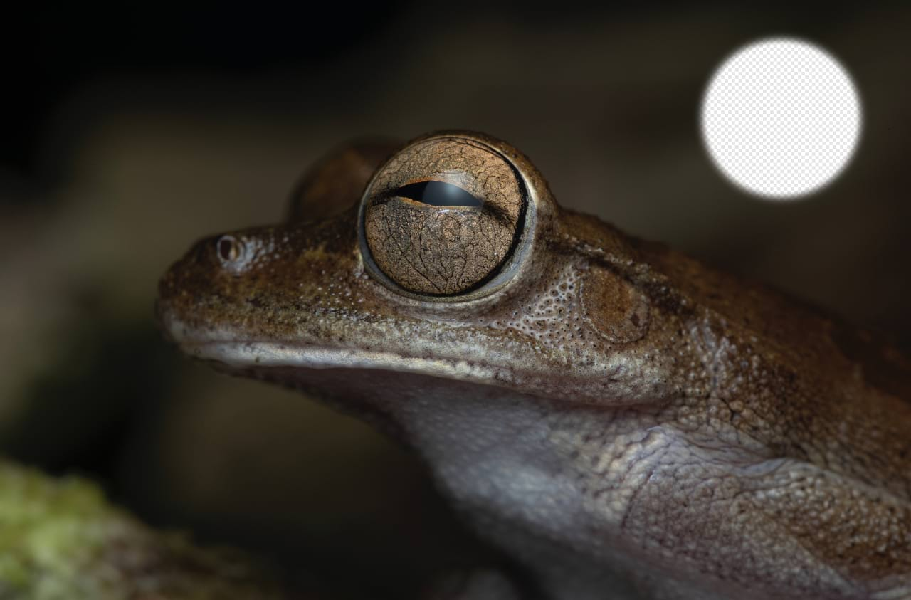

# Erase Brush Tool

You can erase from any area of your photo using the **Erase Brush Tool**. Erased pixels become transparent.

When using the **Paint Brush Tool** on a RAW or image layer, a new mask layer is created with the strokes applied onto it. This aids non-destructive, layer-based workflows whereby the newly created layer can be switched off from view to investigate the effects of erasing quickly.

### Settings

The following settings can be adjusted from the context toolbar:

- **Width**—the brush (stroke) size in pixels. Type directly in the text box or drag the pop-up slider to set the value.
- **Opacity**—how see-through the brush is. 100% opacity erases pixels completely on the first pass. A lower opacity only partially erases the pixels.
- **Flow**—how fast the brush effect is applied (1% is very slow, 100% is immediate). Type directly in the text box or drag the pop-up slider to set the value.
- **Hardness**—how hard the edges of the brush are. The brush appears softer as the percentage decreases. Type directly in the text box or drag the pop-up slider to set the value.
- **More**—click to display the [Brushes](../../23-painting-and-erasing/06-modifying-brushes.md) dialog to access advanced brush settings.
- **Force pressure to control size**—Click to control brush size with pressure if using a pressure-sensitive device. This overrides brush defaults.
- **Stabilizer**—enables stroke stabilization using either a **Rope stabilizer** or **Window stabilizer** mode; the former drags the stroke end by a 'rope' to smooth the stroke but lets you introduce sharp corners at increasing rope **Length** (radius) values by redirecting the slackened rope; the latter will smooth the stroke by averaging sampled input positions within a **Window** whose size is configurable.
- **Symmetry**—when set to greater than 0, repeats the brush stroke around a number of axes (defined by the symmetry value). The center axis point can be repositioned by click-dragging it.
- **Mirror**—with symmetry enabled, causes brush strokes to be mirrored along the X and Y axis.
- **Lock**—when checked, prevents the symmetry line from being moved.
- **Wet Edges**—builds paint up along the edges of your pixel brush stroke, producing a watercolor effect. Check **Custom** and either apply a preset **Standard profile** or draw a custom profile using the chart; both subtly changes how watery the stroke appears.

> **Note:** This Brush Tool can be associated with a particular brush on the **Brushes** panel. For more information, see the [Modifying brushes](../../23-painting-and-erasing/06-modifying-brushes.md) topic.

#### SEE ALSO:

- [Erasing](../../23-painting-and-erasing/02-erasing.md)
- [Paint Brush Tool](../05-paint-tools/01-paint-brush-tool.md)
- [Keyboard shortcuts for tools](../../36-keyboard-shortcuts/01-keyboard-shortcuts.md)
