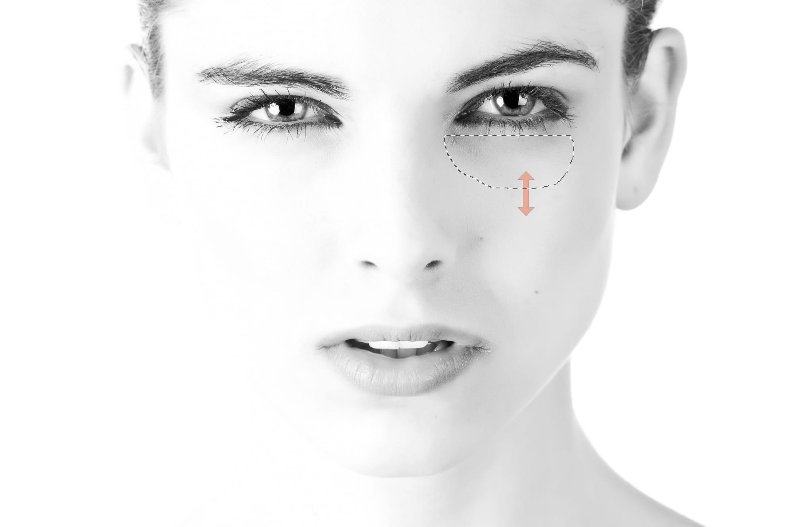

# Patch Tool

The **Patch Tool** allows you to repair a more extensive area of an image by selecting pixels and replacing them from another target area of your current or other document.

## About Patch Tool

The tool makes it easy to substitute pixels of one area with those sampled from another, more pleasing regions. For example, as seen in the example above, the **Patch Tool** may be used to remove and replace imperfections under people's eyes in portraiture.

> **Note:** Context toolbar settings are remembered when switching between documents.

### Settings

The following settings can be adjusted from the context toolbar:

- Mode—select from **New**, **Add**, **Subtract**, and **Intersect**.
- **Selection is source**—if this option is off (default), the selection is the target area where pixels will be replaced. When selected, the selection is the source area from where pixels will be copied.
- **Texture Only**—if this option is off (default), hue information from the source area is preserved and the target area's hue will update accordingly. When selected, hue information from the source area is disregarded and the target area's hue will remain unchanged.
- **Transparent**—if this option is off (default), the source area is placed on the target area as fully opaque. When selected, the source area is placed one the target area with varying transparency depending on the color value of individual pixels.
- Source—the source determines the layer(s) from which the pixels are sampled. Select from the pop-up menu. The 'Global' option enables patching using pixels previously sampled in another document (pixel layer only).
- **Set Global Source**—sets the currently defined sample origin as a global source for use in other images.
- **Rotation**—sets the degree of rotation applied to the sample. The result can be previewed inside the selection. Type directly in the text box or drag the pop-up slider to set the value.
- **Scale**—sets the scale of the sample between 1% and 1000%. Type directly in the text box or drag the pop-up slider to set the value. The result can be previewed inside the selection.

### About selection modes

The four modes available from the context toolbar affect how your selection develops.

- **New**—cancels all current selections and creates a new selection.
- **Add**—adds areas to the current selection. If there is no selection in place, a new selection will be created.
- **Subtract**—removes areas from the current selection.
- **Intersect**—a new selection area is created from the overlap between the newly added selection area and the current selection.

#### SEE ALSO:

- [Patching](../../09-retouching/06-patching.md)
- [Healing Brush Tool](10-healing-brush-tool.md)
- [Blemish Removal Tool](12-blemish-removal-tool.md)
- [Inpainting Brush Tool](13-inpainting-brush-tool.md)
- [Keyboard shortcuts for tools](../../36-keyboard-shortcuts/01-keyboard-shortcuts.md)
