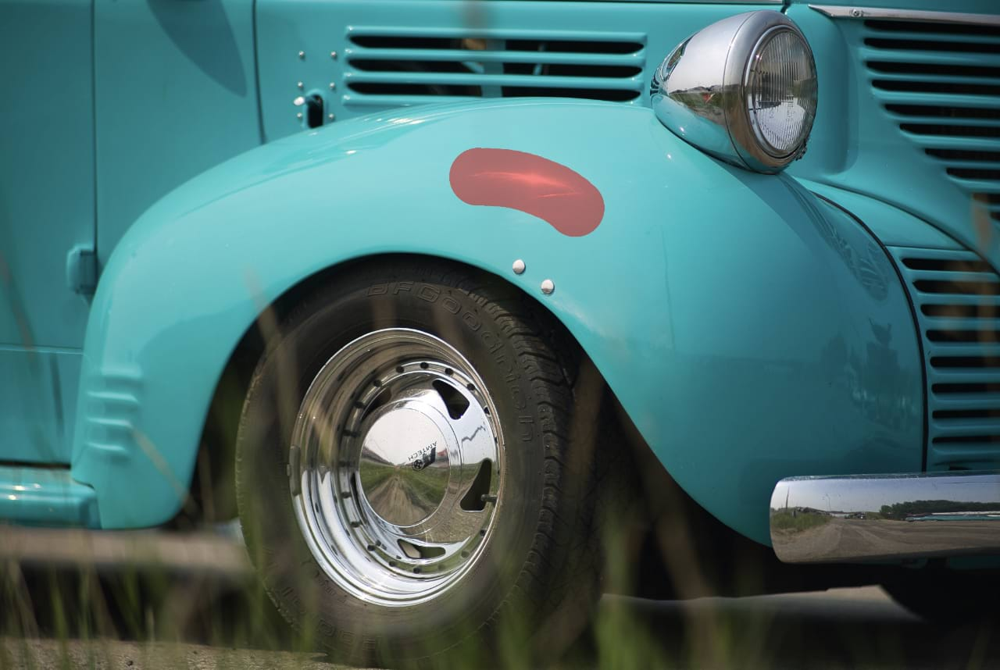

# Inpainting Brush Tool

The **Inpainting Brush Tool** restores damaged, lost, deteriorated or unwanted areas of an image.

When inpainting on an image or RAW layer, that layer is rasterized upon applying the strokes. This behavior can be modified in the app's **Assistant** section in **Settings**.

> **Note:** Context toolbar settings are remembered when switching between documents.

### Settings

The following settings can be adjusted from the context toolbar:

- **Width**—the brush (stroke) size in pixels. Type directly in the text box or drag the pop-up slider to set the value.
- **Opacity**—how see-through the brush is. Type directly in the text box or drag the pop-up slider to set the value.
- **Flow**—how fast the brush effect is applied (1% is very slow, 100% is immediate). Type directly in the text box or drag the pop-up slider to set the value.
- **Hardness**—how hard the edges of the brush are. The brush appears softer as the percentage decreases. Type directly in the text box or drag the pop-up slider to set the value.
- **More**—click to display the [Brushes](../../23-painting-and-erasing/06-modifying-brushes.md) dialog to access advanced brush settings.
- **Force pressure to control size**—Click to control brush size with pressure if using a pressure-sensitive device. This overrides brush defaults.
- **Stabilizer**—enables stroke stabilization using either a **Rope stabilizer** or **Window stabilizer** mode; the former drags the stroke end by a 'rope' to smooth the stroke but lets you introduce sharp corners at increasing rope **Length** (radius) values by redirecting the slackened rope; the latter will smooth the stroke by averaging sampled input positions within a **Window** whose size is configurable.
- **Source**—select from **Current Layer** and **Current Layer & Below**.

> **Note:** This Brush Tool can be associated with a particular brush on the **Brushes** panel. For more information, see the [Modifying brushes](../../23-painting-and-erasing/06-modifying-brushes.md) topic.

#### SEE ALSO:

- [Inpainting](../../09-retouching/05-inpainting.md)
- [Healing Brush Tool](10-healing-brush-tool.md)
- [Patch Tool](11-patch-tool.md)
- [Blemish Removal Tool](12-blemish-removal-tool.md)
- [Keyboard shortcuts for tools](../../36-keyboard-shortcuts/01-keyboard-shortcuts.md)
