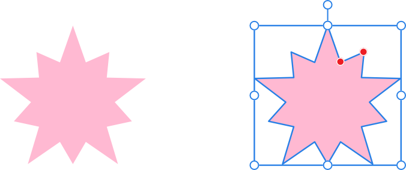
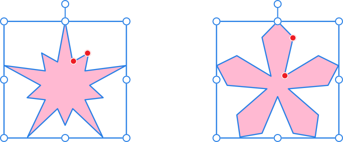

# Double Star Tool

The **Double Star Tool** enables you to create all sorts of stars quickly and easily. The Double Star Tool can have different values for its primary and secondary points to create a unique appearance.

*Default shape and handle position (in red) before customization.*

## Customization

The **Double Star Tool** has several options on the shape and on the context toolbar to enable the number of (primary) points and the inner radius (length of points) of the primary and secondary points to be controlled.

*Two possible outcomes when the options are customized.*

### Settings

The following settings can be adjusted from the context toolbar:

- **Fill**—click the color swatch to display a pop-up panel to update fill color.
- **Stroke**—click the color swatch to display a pop-up panel to update stroke color.
- **Stroke properties**—set the stroke style, width, joins, cap ends, order and arrowhead settings via a pop-up panel.
-  **Presets**—click to display a pop-up panel from which you may select an existing preset (if any are available) or create a new preset.
- **Points**—sets the number of primary points of the star.
- **Inner radius**—controls the length of the points relative to the center of the star.
- **Point radius**—controls the length of the secondary points relative to the center of the star.
-  **Enable Transform Origin**—displays a movable transform origin about which the shape can be rotated.
-  **Hide Selection while Dragging**—when selected, the object's selection box is temporarily hidden when transforming the object. If this option is off, the selection box remains visible during transformation. The selected behavior persists across all objects unless it is manually switched.
-  **Show Alignment Handles**—when selected, displays alignment handles at the center and edges of the selected object. Hovering over these handles displays a floating guideline across the page. You can drag the handles to position the center or edges of the selected object in line with this guide.
-  **Transform Objects Separately**—when selected, where multiple objects are selected, they can be be resized, rotated and sheared independently of each other instead of transforming the bounding box.
-  **Convert to Curves**—converts the selected object into a series of connected lines and nodes.
- **Keep selected**—when enabled (default), the new shape layer will be selected on creation. When disabled, the new object is deselected which prevents it from adopting the next object’s stroke/fill properties.

> **Note:** To reset any red handle to its default position, simply double-click the handle.

> **Preferences — Settings (or Preferences):** Related behaviors can be adjusted from [the app's settings](../../37-settings-preferences/01-settings-preferences.md):
>
> - **Tools>Tool Handle Size**

#### SEE ALSO:

- [About geometric shapes](../../25-lines-and-shapes/06-about-geometric-shapes.md)
- [Draw and edit shapes](../../25-lines-and-shapes/07-draw-and-edit-shapes.md)
- [Star Tool](08-star-tool.md)
- [Square Star Tool](10-square-star-tool.md)
