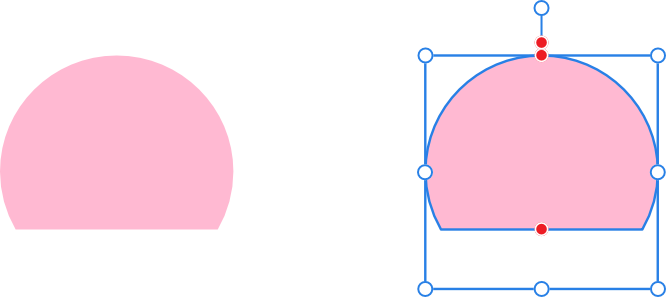
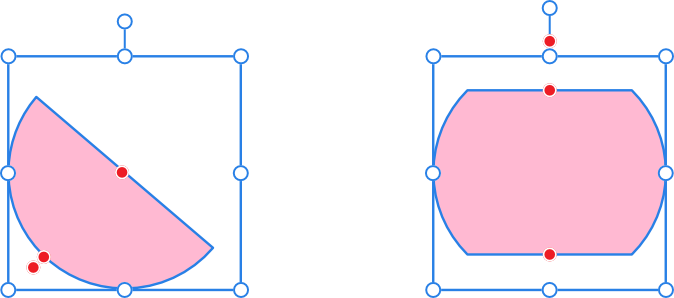

# Segment Tool

The **Segment Tool** makes it easy to create an ellipse with a percentage removed as a section.

*Default shape and handle position (in red) before customization.*

## Customization

The **Segment Tool** has several options on the shape and on the context toolbar to enable the percentage removed from the upper and lower section of the ellipse, and the angle of the ellipse to be controlled.

*Two possible outcomes when the options are customized.*

### Settings

The following settings can be adjusted from the context toolbar:

- **Fill**—click the color swatch to display a pop-up panel to update fill color.
- **Stroke**—click the color swatch to display a pop-up panel to update stroke color.
- **Stroke properties**—set the stroke style, width, joins, cap ends, order and arrowhead settings via a pop-up panel.
-  **Presets**—click to display a pop-up panel from which you may select an existing preset (if any are available) or create a new preset.
- **Angle**—sets the shape's starting angle.
- **Lower**/**Upper line**—controls the position of the shape's two straight lines. This determines the thickness of the segment.
- **Mirror**—updates the above settings to give a reversed (flipped) version of the current shape.

  
- **Negate**—updates the above settings to give the inverse (opposite) of the current shape.

  
-  **Enable Transform Origin**—displays a movable transform origin about which the shape can be rotated.
-  **Hide Selection while Dragging**—when selected, the object's selection box is temporarily hidden when transforming the object. If this option is off, the selection box remains visible during transformation. The selected behavior persists across all objects unless it is manually switched.
-  **Show Alignment Handles**—when selected, displays alignment handles at the center and edges of the selected object. Hovering over these handles displays a floating guideline across the page. You can drag the handles to position the center or edges of the selected object in line with this guide.
-  **Transform Objects Separately**—when selected, where multiple objects are selected, they can be be resized, rotated and sheared independently of each other instead of transforming the bounding box.
-  **Convert to Curves**—converts the selected object into a series of connected lines and nodes.
- **Keep selected**—when enabled (default), the new shape layer will be selected on creation. When disabled, the new object is deselected which prevents it from adopting the next object’s stroke/fill properties.

> **Note:** To reset any red handle to its default position, simply double-click the handle.

> **Preferences — Settings (or Preferences):** Related behaviors can be adjusted from [the app's settings](../../37-settings-preferences/01-settings-preferences.md):
>
> - **Tools>Tool Handle Size**

#### SEE ALSO:

- [About geometric shapes](../../25-lines-and-shapes/06-about-geometric-shapes.md)
- [Draw and edit shapes](../../25-lines-and-shapes/07-draw-and-edit-shapes.md)
- [Ellipse Tool](02-ellipse-tool.md)
