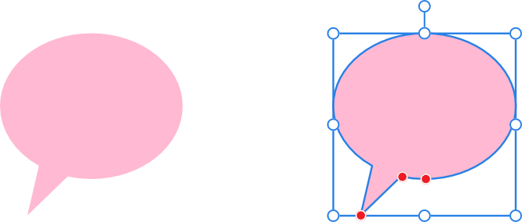
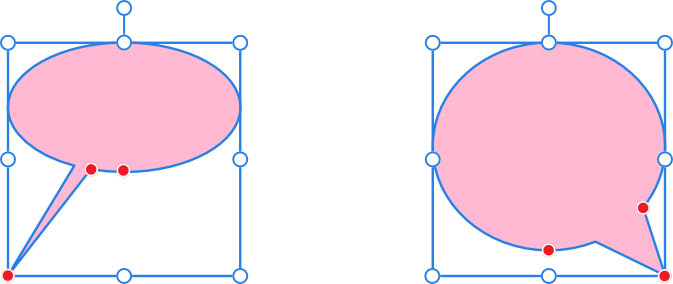

# Callout Ellipse Tool

Create traditional looking callouts and speech bubbles with the **Callout Ellipse Tool**.

*Default shape and handle position (in red) before customization.*

## Customization

The **Callout Ellipse Tool** has several options on the shape and on the context toolbar to enable the size, shape and position of the tail, and the depth of the callout ellipse to be controlled.

*Two possible outcomes when the options are customized.*

### Settings

The following settings can be adjusted from the context toolbar:

- **Fill**—click the color swatch to display a pop-up panel to update fill color.
- **Stroke**—click the color swatch to display a pop-up panel to update stroke color.
- **Stroke properties**—set the stroke style, width, joins, cap ends, order and arrowhead settings via a pop-up panel.
-  **Presets**—click to display a pop-up panel from which you may select an existing preset (if any are available) or create a new preset.
- **Absolute sizes**—by default, the tail height and end position are specified as a percentage of the object and scales as the object is resized. When selected, this option allows you to specify these attributes in units. If the object is resized, the tail height and end position remain the same instead of scaling with the object.
- **Tail height**—controls the height of the shape's protrusion relative to the height of the shape.
- **Tail end position**—controls the position of the point of the protrusion from left (0%) to right (100%), with 50% representing a central point.
- **Tail angle**—controls the width and position of the protrusion along the base of the shape.
-  **Enable Transform Origin**—displays a movable transform origin about which the shape can be rotated.
-  **Hide Selection while Dragging**—when selected, the object's selection box is temporarily hidden when transforming the object. If this option is off, the selection box remains visible during transformation. The selected behavior persists across all objects unless it is manually switched.
-  **Show Alignment Handles**—when selected, displays alignment handles at the center and edges of the selected object. Hovering over these handles displays a floating guideline across the page. You can drag the handles to position the center or edges of the selected object in line with this guide.
-  **Transform Objects Separately**—when selected, where multiple objects are selected, they can be be resized, rotated and sheared independently of each other instead of transforming the bounding box.
-  **Convert to Curves**—converts the selected object into a series of connected lines and nodes.
- **Keep selected**—when enabled (default), the new shape layer will be selected on creation. When disabled, the new object is deselected which prevents it from adopting the next object’s stroke/fill properties.

> **Note:** To reset any red handle to its default position, simply double-click the handle.

> **Preferences — Settings (or Preferences):** Related behaviors can be adjusted from [the app's settings](../../37-settings-preferences/01-settings-preferences.md):
>
> - **Tools>Tool Handle Size**

#### SEE ALSO:

- [About geometric shapes](../../25-lines-and-shapes/06-about-geometric-shapes.md)
- [Draw and edit shapes](../../25-lines-and-shapes/07-draw-and-edit-shapes.md)
- [Callout Rounded Rectangle Tool](18-callout-rounded-rectangle-tool.md)
- [Ellipse Tool](02-ellipse-tool.md)
