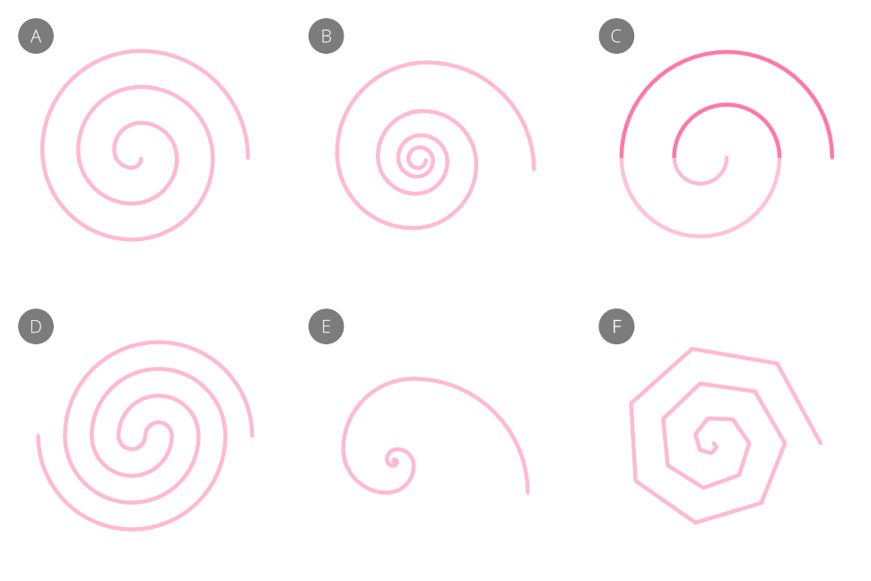
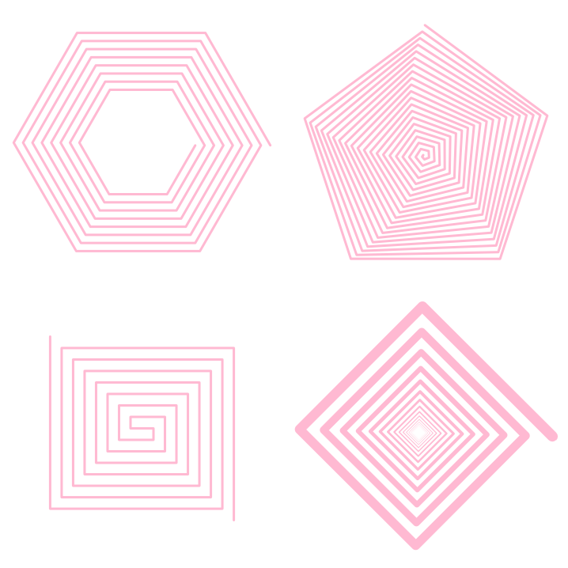
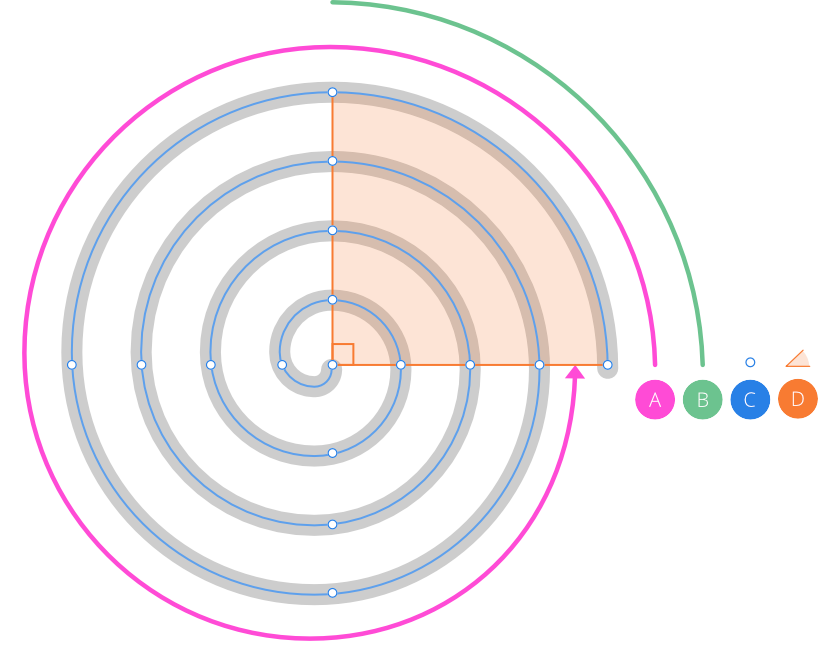
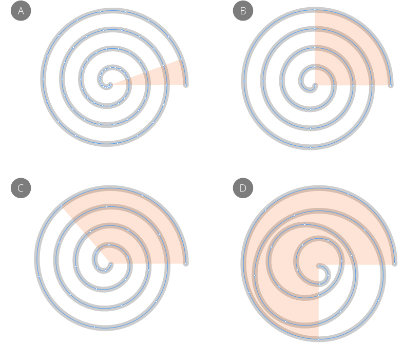
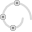
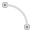
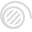
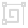

# Spiral Tool

The **Spiral Tool** enables you to create a multitude of different spiral shapes.

## Spiral styles

The **Spiral Tool** has several styles and options on its context toolbar to change the spiral's design.

*Spiral styles: (A) Linear, (B) Decaying, (C) Semi-circular*, (D) Counter semi-circular, (E) Fibonacci, (F) Plotted  
 * Shaded semi-circles shown for illustrative purposes*

A spiral's appearance can also be dramatically changed by presenting it with straight-line 'cusped' edges.

*Spiral examples with cusped edges*

## About spiral geometry

In Affinity, a spiral is made up of a series of arcs stretching its full length; each arc is used to shape the spiral. As the number of turns of the spiral increases, the more arcs are needed to draw the spiral as intended.

*Spiral anatomy: (A) Full turn, (B) Arc, (C) Points, (D) Arc angle (set to 90°)*

The arc angle can be increased beyond 90° (default) to create increasingly uneven, and even chaotic, spirals the greater the angle. Points will appear along the spiral at each angle interval and will reposition according to the arc angle.

*Spiral arc angles (Linear spiral style): (A) 20°, (B) 90°, (C) 130°, (D) 270°*

Spirals display a series of non-editable points along their path which help to indicate the shape's geometry and resulting node positions if the spiral is [converted to curves](../../25-lines-and-shapes/12-converting-to-curves.md).

All spiral styles create logarithmic spirals with the exception of the Plotted style which creates true spirals that are mathematically calculated.

### Settings

The following settings can be adjusted from the context toolbar:

- **Fill**—click the color swatch to display a pop-up panel to update fill color.
- **Stroke**—click the color swatch to display a pop-up panel to update stroke color.
- **Stroke properties**—set the stroke style, width, joins, cap ends, order and arrowhead settings via a pop-up panel.
-  **Presets**—click to display a pop-up panel from which you may select an existing preset (if any are available) or create a new preset.
- **Style**—select a spiral style for a different look—this can be done in advance of spiral creation or to swap the spiral to another style at any time. (See examples above.)
  - **Linear**—this basic spiral creates an even gap between each spiral turn when the arc angle is >90°; angles exceeding this will create an increasingly uneven look to the spiral the greater the angle. The spiral is drawn inwards towards the spiral center. Settings are:
    - **Arc angle**—sets the angle to which all arcs on the spiral will conform to.
    - **Inner radius**—moves the inner spiral start position out from the object center.
  - **Decaying**—the gap between each spiral turn decreases the nearer the curve gets to the spiral center. This is controlled by a **Decay** value. Settings are:
    - **Arc angle**—sets the angle to which all arcs on the spiral will conform to.
    - **Decay**—sets the percentage decay rate along the spiral from the outer end of the spiral to the spiral center.
    -  **Decay per turn**—the decay rate set by the **Decay** value is calculated across a full turn.
    -  **Decay per arc**—as for **Decay per turn** but the calculation is made across an arc rather than a full turn.
    - **Minimum radius**—sets the least amount that the spiral can decay to at its center.
    -  **Cap inside with circle**—when enabled, a circular cap is used to terminate the inner end of the spiral. When disabled, the inner end of the spiral will remain open.
  - **Semi-circular**—like a Linear spiral but the spiral is composed of semi-circular arcs that double in size as they are drawn outwards from the spiral center; they only have a customizable number of turns.
  - **Counter semi-circular**—like a semi-circular spiral but the spiral doubles back on itself, creating a spiral with two 'tails'.
  - **Fibonacci**—the spiral approximates the golden spiral using quarter turn angles derived from the Fibonacci sequence (0,1,1,2,3,5,8,13); the spiral is drawn out from its center.
  - **Plotted**—this mathematically calculated 'true' spiral has linear lines, called divisions, between points. Settings are:
    - **Divisions**—sets the number of straight-lined divisions on the spiral per turn.
    - **Inner radius**—moves the inner spiral start position out from the object center.
    - **Bias**—controls arc distribution along the spiral by setting the interpolation bias of the spiral.
-  **Use cusped segments**—when enabled, the spiral will have straight lines between points. When disabled (default) the spiral is a continuous curve that winds outwards from the spiral center.
-  **Spiral clockwise**—the spiral winds in a clockwise direction.
-  **Spiral anti-clockwise**—the spiral winds in an anti-clockwise direction.
- **Turns**—increases or decreases the number of winding turns between the start and end of the spiral, counted from the spiral center.
- **Angle of partial turns**—applies the angle to the outside of an arc to add the partial turn. Use for fine control of spiral at ends.
-  **Enable Transform Origin**—displays a movable transform origin about which the shape can be rotated.
-  **Hide Selection while Dragging**—when selected, the object's selection box is temporarily hidden when transforming the object. If this option is off, the selection box remains visible during transformation. The selected behavior persists across all objects unless it is manually switched.
-  **Show Alignment Handles**—when selected, displays alignment handles at the center and edges of the selected object. Hovering over these handles displays a floating guideline across the page. You can drag the handles to position the center or edges of the selected object in line with this guide.
-  **Transform Objects Separately**—when selected, where multiple objects are selected, they can be be resized, rotated and sheared independently of each other instead of transforming the bounding box.
-  **Convert to Curves**—converts the selected object into a series of connected lines and nodes.
- **Keep selected**—when enabled (default), the new shape will be selected on creation. When disabled, the new object is deselected which prevents it from adopting the next object’s stroke/fill properties.

#### SEE ALSO:

- [About geometric shapes](../../25-lines-and-shapes/06-about-geometric-shapes.md)
- [Draw and edit shapes](../../25-lines-and-shapes/07-draw-and-edit-shapes.md)
