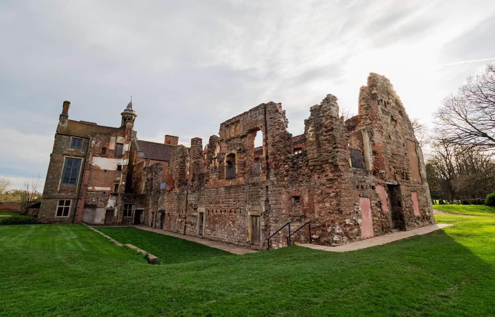
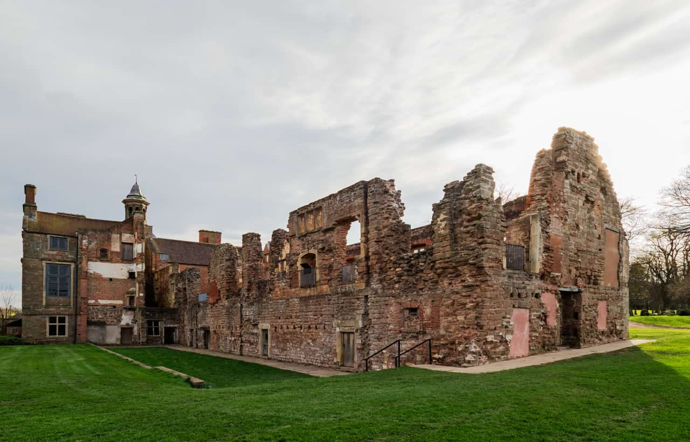

# Perspective Tool

The **Perspective Tool** allows you to modify the perspective of your image. It has full History support, meaning each modification (such as handle dragging and option toggling) can be undone.

*Using the Perspective Tool to alter the appearance of a building/structure.*

### Settings

The settings can be adjusted from the pop-up dialog after selecting the tool:

- **Planes**—set the number of planes on which perspective can be applied. Select from the pop-up menu.
- **Mode**—set the mode in which the grid will operate. 'Destination' automatically applies perspective to the whole image as you adjust the grid. 'Source' lets you size, position and shape the grid without affecting the image; you can then apply perspective to the image by jumping back to the 'Destination' option and dragging handles.
- **Show Grid**—when selected, a grid displays over your image to allow you to adjust the perspective with precision. If this option is off, only the boundaries of the perspective area is displayed.
- **Autoclip**—(Available in Dual Plane mode) Specifies whether or not to alter the image beyond the boundaries of the perspective grid points. If disabled, the image will look continuous; if enabled, the image will have visible seams where the perspective tool has been applied that can then be retouched.
-   **Rotate clockwise** / **Rotate anti-clockwise**—rotates the image right or left in 90° increments.
-   **Flip horizontal** / **Flip vertical**—Mirrors the image across either the horizontal or vertical axis.
- **Select Destination**—alters pixel selection to the whole document if no pixel selection has been performed. If however an area of an image has been targeted using any of the pixel selection tools, choosing this option will restrict the effect of the tool (e.g. rotation) to the specified region.
-    **No split view** / **Split view** / **Mirror view**—by default, your image shows the current perspective applied. 'Split view' offers the adjusted and original images simultaneously with a sliding divider which can be repositioned and shows 'Before' and 'After'; 'Mirror view' is as for Split view but the 'Before' and 'After' panes show the entire images side by side, without the ability to slide the divider.

#### SEE ALSO:

- [Perspective](../../05-sizing-cropping-and-warping/07-perspective.md)
- [Perspective Filter](../../11-filters-and-effects/04-distortion-filters/10-filter-perspective.md)
- [Mesh Warp Tool](01-mesh-warp-tool.md)
